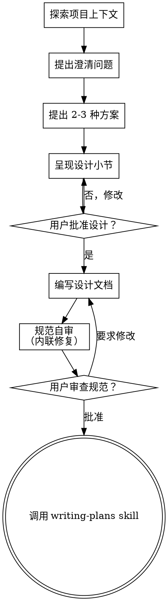

# 将想法 Brainstorm 成设计 (Brainstorming Ideas Into Designs)

通过自然的协作对话，帮助把想法转变为完全成形的设计和规范（spec）。

从理解当前项目上下文开始，然后一次一个问题地提问来细化想法。一旦你理解了要构建什么，就呈现设计并获得用户批准。

<HARD-GATE>
在你呈现设计并获得用户批准之前，不要调用任何实现 skill、编写任何代码、搭建任何项目或采取任何实现行动。这适用于每个项目，无论看起来多简单。
</HARD-GATE>

## 反模式："这太简单了，不需要设计" (Anti-Pattern)

每个项目都要经过这个流程。一个 todo 列表、一个单函数工具、一个配置改动——全部都是。"简单"的项目正是未经审视的假设造成最多返工的地方。设计可以很短（对于真正简单的项目几句话即可），但你必须呈现它并获得批准。

## 检查清单 (Checklist)

你必须为以下每一项创建一个任务，并按顺序完成：

1. **探索项目上下文** —— 检查文件、文档、最近的 commits
2. **即时（just-in-time）提供视觉伴侣** —— 不要预先提供。第一次出现"展示比描述更清晰"的问题时，那时再提供（作为独立消息）；用户同意后，它的浏览器标签页会为你打开。如果从未出现视觉问题，绝不提供。见下方的视觉伴侣（Visual Companion）小节。
3. **提出澄清问题** —— 一次一个，理解目的/约束/成功标准
4. **提出 2-3 种方案** —— 含权衡和你的推荐
5. **呈现设计** —— 按复杂度分节，每节后获得用户批准
6. **编写设计文档** —— 保存到 `docs/superpowers/specs/YYYY-MM-DD-<topic>-design.md` 并提交
7. **规范自审（Spec self-review）** —— 快速内联检查占位符、矛盾、歧义、范围（见下文）
8. **用户审查书面规范** —— 在继续之前请用户审查 spec 文件
9. **过渡到实现** —— 调用 writing-plans skill 创建实现计划

## 流程图 (Process Flow)

**终态是调用 writing-plans。** 不要调用 frontend-design、mcp-builder 或任何其他实现 skill。brainstorming 之后你调用的唯一 skill 是 writing-plans。

## 流程 (The Process)

**理解想法：**

- 先查看当前项目状态（文件、文档、最近的 commits）
- 在提出详细问题之前，评估范围：如果请求描述了多个独立子系统（例如"构建一个包含聊天、文件存储、计费和分析的平台"），立即标记这一点。不要把问题花在细化一个需要先分解的项目细节上。
- 如果项目对单个 spec 来说太大，帮助用户分解为子项目：独立的部分是什么，它们如何关联，应该以什么顺序构建？然后通过正常的设计流程 brainstorm 第一个子项目。每个子项目有自己的 spec → plan → 实现周期。
- 对于范围合适的项目，一次一个问题地提问来细化想法
- 尽可能使用多选题，但开放式也可以
- 每条消息只问一个问题——如果某个话题需要更多探索，把它拆成多个问题
- 专注于理解：目的、约束、成功标准

**探索方案：**

- 提出 2-3 种不同方案及其权衡
- 以对话方式呈现选项，附上你的推荐和理由
- 以你推荐的选项开头并解释原因

**呈现设计：**

- 一旦你确信理解了要构建什么，就呈现设计
- 按复杂度缩放每一节：直接的几句话即可，微妙的最多 200-300 字
- 每节后询问到目前为止是否合理
- 涵盖：架构、组件、数据流、错误处理、测试
- 准备好在不合理时回去澄清

**为隔离和清晰而设计：**

- 把系统分解为更小的单元，每个单元有单一明确的目的，通过定义良好的接口通信，并能独立理解和测试
- 对每个单元，你应该能回答：它做什么，你怎么使用它，它依赖什么？
- 别人能不读内部实现就理解一个单元做什么吗？你能不改消费者就改动内部吗？如果不能，边界还需要打磨。
- 更小、边界良好的单元也更容易让你处理——你能更好地推理可以一次性放入上下文的代码，当文件聚焦时你的编辑更可靠。当一个文件变大时，那通常是一个信号：它承担了太多职责。

**在现有代码库中工作：**

- 在提出改动之前探索当前结构。遵循既有模式。
- 当既有代码存在影响当前工作的问题时（例如一个变得太大的文件、不清晰的边界、纠缠的职责），把有针对性的改进作为设计的一部分——就像一个好的开发者会改进自己正在其中工作的代码。
- 不要提出无关的重构。保持专注于服务于当前目标的内容。

## 设计之后 (After the Design)

**文档：**

- 把验证过的设计（spec）写入 `docs/superpowers/specs/YYYY-MM-DD-<topic>-design.md`
  - （用户对 spec 位置的偏好优先于此默认值）
- 如果可用，使用 elements-of-style:writing-clearly-and-concisely skill
- 把设计文档提交到 git

**规范自审（Spec Self-Review）：**
写完 spec 文档后，以全新的眼光审视它：

1. **占位符扫描：** 有任何"TBD"、"TODO"、未完成的章节或模糊的需求吗？修复它们。
2. **内部一致性：** 各章节有相互矛盾吗？架构与功能描述匹配吗？
3. **范围检查：** 它对单个实现计划足够聚焦，还是需要分解？
4. **歧义检查：** 任何需求是否可能有两种解读？如果是，选一种并明确化。

内联修复任何问题。无需重新审查——修复后继续。

**用户审查关卡（User Review Gate）：**
spec 审查循环通过后，在继续之前请用户审查书面规范：

> "Spec 已写入并提交到 `<path>`。请审查它，并告诉我是否想在开始编写实现计划之前做任何改动。"

等待用户响应。如果他们要求改动，做出改动并重新运行 spec 审查循环。仅在用户批准后继续。

**实现：**

- 调用 writing-plans skill 创建详细实现计划
- 不要调用任何其他 skill。writing-plans 是下一步。

## 关键原则 (Key Principles)

- **一次一个问题** —— 不要用多个问题淹没对方
- **优先多选题** —— 可能时比开放式更易回答
- **无情地 YAGNI** —— 从所有设计中移除不必要的功能
- **探索替代方案** —— 在确定前总是提出 2-3 种方案
- **增量验证** —— 呈现设计，继续之前获得批准
- **保持灵活** —— 在不合理时回去澄清

## 视觉伴侣 (Visual Companion)

一个基于浏览器的伴侣，用于在 brainstorming 期间展示模型（mockup）、图表和视觉选项。作为一个工具提供——不是一个模式。接受伴侣意味着它可用于受益于视觉处理的问题；这并不意味着每个问题都经过浏览器。

**提供伴侣（即时）：** 不要预先提供。等到一个问题确实"展示比讲述更清晰"——一个真正的模型/布局/图表问题，而不仅仅是一个 UI 话题。第一次发生时，那时再提供，作为独立消息：
> "接下来这部分如果我展示给你可能更容易——我可以在浏览器标签页中为你组装模型、图表和对比。它还比较新，可能比较耗费 token。要我这么做吗？我会为你打开它。"

**这个提议必须是独立消息。** 只有提议——没有澄清问题、摘要或其他内容。等待用户响应。如果他们接受，用 `--open` 启动服务器，这样他们的浏览器会自动打开到第一个界面。如果他们拒绝，继续纯文本，除非他们提起，否则不再提供。

**逐问题决定：** 即使在用户接受之后，也要为每个问题决定使用浏览器还是终端。测试标准是：**用户看到它是否比读到它更容易理解？**

- **使用浏览器**处理本身是视觉的内容 —— 模型、线框图、布局对比、架构图、并排视觉设计
- **使用终端**处理本身是文本的内容 —— 需求问题、概念选择、权衡列表、A/B/C/D 文本选项、范围决策

一个关于 UI 话题的问题不自动是视觉问题。"在这个上下文中 personality 是什么意思？"是概念问题——用终端。"哪种向导布局更好？"是视觉问题——用浏览器。

如果他们同意使用伴侣，在继续之前阅读详细指南：
`skills/brainstorming/visual-companion.md`
