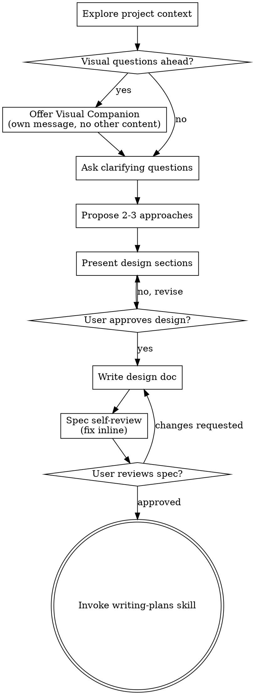

# Brainstorming Ideas Into Designs

## 概述 (Overview)

通过自然的协作对话，帮助将想法转化为完全成型的 designs（设计）和 specs（规范）。

首先了解当前的项目背景，然后一次问一个问题来完善想法。一旦你理解了你要构建什么，就展示 design 并获得用户批准。

<HARD-GATE>
在展示 design 且用户批准之前，不要调用任何实施 skill、编写任何代码、搭建任何项目或采取任何实施行动。这适用于每个项目，无论感知的简单程度如何。
</HARD-GATE>

## 反模式: "这太简单了不需要 Design"

每个项目都要经过这个流程。一个待办列表、一个单函数工具、一个配置更改——所有这些。"简单" 项目恰恰是未经审视的假设导致最多浪费工作的地方。Design 可以很短（对于真正简单的项目只需几句话），但你必须展示它并获得批准。

## 检查清单 (Checklist)

你必须为以下每个项目创建任务并按顺序完成：

1. **探索项目上下文** — 检查文件、文档、最近的 commits
2. **提供视觉伴侣** (如果主题将涉及视觉问题) — 这是独立的消息，不与澄清问题组合。参见下方的 Visual Companion 部分。
3. **提出澄清问题** — 一次一个，理解目的/约束/成功标准
4. **提出 2-3 种方法** — 带权衡和你的推荐
5. **展示 design** — 按其复杂度分节展示，每节后获得用户批准
6. **编写 design 文档** — 保存到 `docs/superpowers/specs/YYYY-MM-DD-<topic>-design.md` 并 commit
7. **Spec 自我审查** — 快速内联检查占位符、矛盾、歧义、范围 (见下方)
8. **用户审查书面 spec** — 要求用户在继续之前审查 spec 文件
9. **过渡到实施** — 调用 writing-plans skill 创建实施 plan

## 流程图 (Process Flow)

**终止状态是调用 writing-plans。** 不要调用 frontend-design、mcp-builder 或任何其他实施 skill。你在 brainstorming 后调用的唯一 skill 是 writing-plans。

## 流程 (The Process)

**理解想法:**
- 首先检查当前的项目状态（文件、文档、最近的 commits）
- 在提出详细问题之前，评估范围：如果请求描述了多个独立的子系统（例如，"构建一个包含聊天、文件存储、计费和分析的平台"），立即标记。不要花时间在需要先分解的项目上细化细节。
- 如果项目太大无法放入单个 spec，帮助用户分解为子项目：独立的组件是什么，它们如何关联，应该以什么顺序构建？然后通过正常的 design 流程 brainstorm 第一个子项目。每个子项目有自己的 spec → plan → 实施 循环。
- 对于范围合适的项目，一次问一个问题来完善想法
- 尽可能优先选择多项选择题，但开放式问题也可以
- 每条消息只有一个问题——如果一个话题需要更多探索，将其分解为多个问题
- 专注于理解：目的、约束、成功标准

**探索方法:**
- 提出 2-3 种具有权衡的不同方法
- 以对话方式展示选项，并附上你的推荐和理由
- 把你推荐的选项放在最前面，并解释原因

**展示 Design:**
- 一旦你认为你理解了你要构建什么，就展示 design
- 按其复杂度缩放每个部分：如果简单则几句话，如果复杂则最多 200-300 字
- 在每一节之后询问目前看起来是否正确
- 涵盖：架构、组件、数据流、错误处理、测试
- 如果有些地方说不通，准备好回头澄清

**为隔离和清晰而设计:**

- 将系统分解为较小的单元，每个单元都有一个明确的目的，通过明确定义的接口进行通信，并且可以独立理解和测试
- 对于每个单元，你应该能够回答：它做什么，你怎么使用它，它依赖什么？
- 有人能在不阅读其内部的情况下理解一个单元做什么吗？你能在不破坏使用者的情况下更改内部吗？如果不能，边界需要调整。
- 较小的、边界良好的单元也更容易让你操作——你对能一次性放在上下文中的代码推理得更好，当文件聚焦时你的编辑也更可靠。当一个文件变大时，这通常是它在做太多事情的信号。

**在现有 codebase 中工作:**
- 在提出更改之前探索当前结构。遵循现有模式。
- 当现有代码存在影响工作的问题时（例如，变得太大的文件、不清晰的边界、纠缠的职责），将针对性的改进作为 design 的一部分——就像一个优秀的开发人员在处理的代码中改进代码一样。
- 不要提出无关的重构。保持专注于为当前目标服务的内容。

## Design 之后

**文档:**
- 将经过验证的 design (spec) 写入 `docs/superpowers/specs/YYYY-MM-DD-<topic>-design.md`
  - (用户的 spec 位置偏好会覆盖此默认值)
- 如果可用，使用 elements-of-style:writing-clearly-and-concisely skill
- 将 design 文档 commit 到 git

**Spec 自我审查:**
写完 spec 文档后，用全新的眼光查看它：

1. **占位符扫描:** 任何 "TBD"、"TODO"、不完整的部分或模糊的需求？修复它们。
2. **内部一致性:** 任何部分互相矛盾吗？架构是否与功能描述匹配？
3. **范围检查:** 这足够聚焦于单个实施 plan 吗，还是需要分解？
4. **歧义检查:** 任何需求可以被两种不同方式解释吗？如果是，选择一种并使其明确。

内联修复任何问题。无需重新审查——修复后继续。

**用户审查关卡:**
Spec 审查循环通过后，要求用户在继续之前审查书面 spec：

> "Spec 已写入并 commit 到 `<path>`。请在开始编写实施 plan 之前审查它，如果需要做任何更改请告诉我。"

等待用户的回复。如果他们要求更改，进行更改并重新运行 spec 审查循环。只有在用户批准后才继续。

**实施:**
- 调用 writing-plans skill 创建详细的实施 plan
- 不要调用任何其他 skill。writing-plans 是下一步。

## 关键原则 (Key Principles)

- **一次一个问题** - 不要用多个问题压倒对方
- **优先选择多项选择** - 在可能的情况下，比开放式问题更容易回答
- **无情地 YAGNI** - 从所有 designs 中删除不必要的功能
- **探索替代方案** - 在定案之前总是提出 2-3 种方法
- **增量验证** - 分节展示 design，在继续之前获得批准
- **保持灵活** - 当有些地方说不通时，回头澄清

## Visual Companion (视觉伴侣)

一个基于浏览器的伴侣，用于在 brainstorming 期间展示模型图、图表和视觉选项。作为工具可用——不是一种模式。接受伴侣意味着它可以用于受益于视觉处理的问题；这并不意味着每个问题都通过浏览器处理。

**提供伴侣:** 当你预期即将到来的问题将涉及视觉内容（模型图、布局、图表）时，一次性提供以获得同意：
> "我们正在处理的一些内容，如果我能在浏览器中展示给你看可能更容易解释。我可以在过程中组合模型图、图表、比较和其他视觉效果。这个功能还比较新，可能会消耗较多 token。想试试吗？（需要打开本地 URL）"

**此提议必须是独立的消息。** 不要将其与澄清问题、上下文总结或任何其他内容组合。消息应该只包含上述提议，别无其他。在继续之前等待用户的回复。如果他们拒绝，继续纯文本 brainstorming。

**按问题决策:** 即使在用户接受后，也要为每个问题决定是使用浏览器还是终端。判断标准：**用户通过看到它比阅读它更能理解吗？**

- **使用浏览器** 处理视觉内容——模型图、线框图、布局比较、架构图、并排视觉设计
- **使用终端** 处理文本内容——需求问题、概念选择、权衡列表、A/B/C/D 文本选项、范围决策

关于 UI 主题的问题不自动就是视觉问题。"在这个上下文中 personality 意味着什么？" 是概念性问题——使用终端。"哪种向导布局更好？" 是视觉问题——使用浏览器。

如果他们同意使用伴侣，在继续之前阅读详细指南：
`skills/brainstorming/visual-companion.md`
