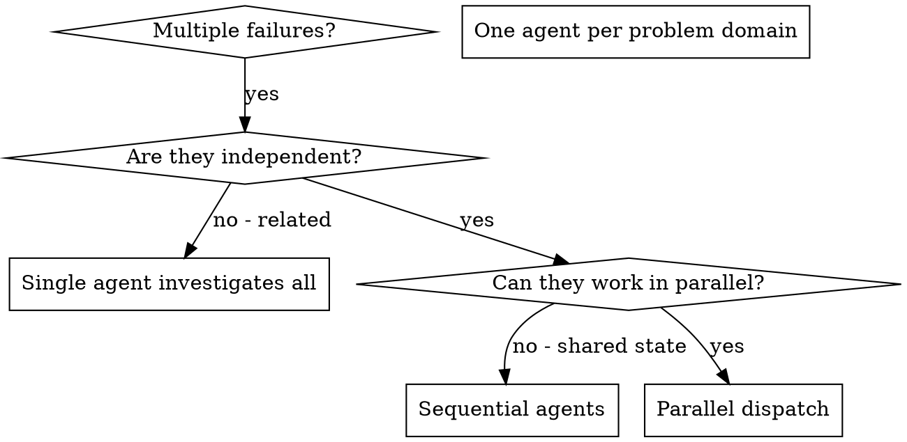

# Dispatching Parallel Agents

## 概述 (Overview)

当你有多个不相关的 failures（失败）（不同的测试文件、不同的子系统、不同的 bug）时，按顺序调查它们会浪费时间。每个调查都是独立的，可以并行进行。

**核心原则:** 为每个独立的问题 domain（领域）分派一个 agent。让它们并发工作。

## 何时使用 (When to Use)



**使用场景:**
- 3+ 个测试文件因不同的根本原因失败
- 多个子系统独立损坏
- 每个问题都可以在没有其他问题背景的情况下被理解
- 调查之间没有共享状态

**不使用场景:**
- Failures 是相关的（修复一个可能会修复其他）
- 需要了解完整的系统状态
- Agents 会相互干扰

## 模式 (The Pattern)

### 1. 识别独立 Domains

根据损坏的内容将 failures 分组：
- 文件 A 测试：工具批准流程
- 文件 B 测试：批量完成行为
- 文件 C 测试：中止功能

每个 domain 都是独立的 - 修复工具批准不会影响中止测试。

### 2. 创建专注的 Agent 任务

每个 agent 获得：
- **特定 Scope (范围):** 一个测试文件或子系统
- **明确目标:** 使这些测试通过
- **约束:** 不要更改其他代码
- **预期输出:** 你发现和修复内容的摘要

### 3. 并行 Dispatch (分派)

```typescript
// In Claude Code / AI environment
Task("Fix agent-tool-abort.test.ts failures")
Task("Fix batch-completion-behavior.test.ts failures")
Task("Fix tool-approval-race-conditions.test.ts failures")
// All three run concurrently
```

### 4. 审查和集成

当 agents 返回时：
- 阅读每个摘要
- 验证修复是否不冲突
- 运行完整的 test suite
- 集成所有更改

## Agent Prompt 结构

好的 agent prompts 是：
1.  **专注** - 一个清晰的问题 domain
2.  **自包含** - 理解问题所需的所有上下文
3.  **对输出具体** - agent 应该返回什么？

```markdown
Fix the 3 failing tests in src/agents/agent-tool-abort.test.ts:

1. "should abort tool with partial output capture" - expects 'interrupted at' in message
2. "should handle mixed completed and aborted tools" - fast tool aborted instead of completed
3. "should properly track pendingToolCount" - expects 3 results but gets 0

These are timing/race condition issues. Your task:

1. Read the test file and understand what each test verifies
2. Identify root cause - timing issues or actual bugs?
3. Fix by:
   - Replacing arbitrary timeouts with event-based waiting
   - Fixing bugs in abort implementation if found
   - Adjusting test expectations if testing changed behavior

Do NOT just increase timeouts - find the real issue.

Return: Summary of what you found and what you fixed.
```

## 常见错误 (Common Mistakes)

**❌ 太宽泛:** "Fix all the tests" - agent 会迷失方向
**✅ 具体:** "Fix agent-tool-abort.test.ts" - 专注的 scope

**❌ 无上下文:** "Fix the race condition" - agent 不知道在哪里
**✅ 上下文:** 粘贴错误消息和测试名称

**❌ 无约束:** Agent 可能会重构所有内容
**✅ 约束:** "Do NOT change production code" 或 "Fix tests only"

**❌ 模糊输出:** "Fix it" - 你不知道改变了什么
**✅ 具体:** "Return summary of root cause and changes"

## 何时不使用 (When NOT to Use)

**相关 failures:** 修复一个可能会修复其他 - 先一起调查
**需要完整上下文:** 理解需要查看整个系统
**探索性调试:** 你还不知道哪里坏了
**共享状态:** Agents 会相互干扰（编辑相同的文件，使用相同的资源）

## 会话中的真实示例

**场景:** 重大重构后，3 个文件中有 6 个测试失败

**Failures:**
- agent-tool-abort.test.ts: 3 个失败 (timing issues)
- batch-completion-behavior.test.ts: 2 个失败 (tools not executing)
- tool-approval-race-conditions.test.ts: 1 个失败 (execution count = 0)

**决定:** 独立 domains - abort 逻辑与批量完成和 race conditions 分离

**Dispatch:**
```
Agent 1 → Fix agent-tool-abort.test.ts
Agent 2 → Fix batch-completion-behavior.test.ts
Agent 3 → Fix tool-approval-race-conditions.test.ts
```

**结果:**
- Agent 1: 用基于事件的等待替换了超时
- Agent 2: 修复了事件结构 bug（threadId 位置错误）
- Agent 3: 添加了等待异步工具执行完成

**集成:** 所有修复独立，无冲突，完整套件变绿

**节省时间:** 并行解决 3 个问题 vs 顺序解决

## 主要好处 (Key Benefits)

1.  **并行化** - 多个调查同时发生
2.  **专注** - 每个 agent 范围窄，需要跟踪的上下文少
3.  **独立性** - Agents 互不干扰
4.  **速度** - 用解决 1 个问题的时间解决 3 个问题

## 验证 (Verification)

Agents 返回后：
1.  **审查每个摘要** - 了解改变了什么
2.  **检查冲突** - Agents 是否编辑了相同的代码？
3.  **运行完整套件** - 验证所有修复协同工作
4.  **抽查** - Agents 可能会犯系统性错误

## 真实世界影响

来自调试会话 (2025-10-03):
- 3 个文件中有 6 个 failures
- 并行 dispatch 了 3 个 agents
- 所有调查并发完成
- 所有修复成功集成
- agent 更改之间零冲突
