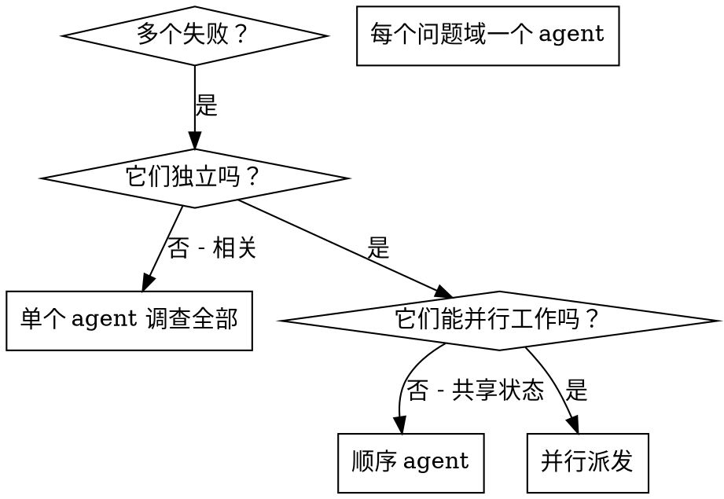

# 派发并行 Agent (Dispatching Parallel Agents)

## 概述 (Overview)

你把任务委托给拥有隔离上下文的专门 agent。通过精确构建它们的指令和上下文，你确保它们保持专注并成功完成各自的任务。它们绝不应该继承你会话的上下文或历史——你精确构造它们所需的内容。这也为你自己的协调工作保留了上下文。

当你有多个不相关的失败（不同的测试文件、不同的子系统、不同的 bug），按顺序调查它们是在浪费时间。每个调查都是独立的，可以并行进行。

**核心原则：** 每个独立的问题域派发一个 agent。让它们并发工作。

## 何时使用 (When to Use)



**使用场景：**
- 3 个以上测试文件因不同根因失败
- 多个子系统独立损坏
- 每个问题无需其他问题的上下文即可理解
- 调查之间无共享状态

**不要使用，当：**
- 失败相关（修一个可能修复其他）
- 需要理解完整系统状态
- Agent 会互相干扰

## 模式 (The Pattern)

### 1. 识别独立域

按"什么坏了"对失败分组：
- 文件 A 测试：工具审批流程
- 文件 B 测试：批处理完成行为
- 文件 C 测试：中止功能

每个域独立——修复工具审批不影响中止测试。

### 2. 创建聚焦的 Agent 任务

每个 agent 获得：
- **明确范围：** 一个测试文件或子系统
- **清晰目标：** 让这些测试通过
- **约束：** 不要改其他代码
- **预期输出：** 你发现并修复了什么的摘要

### 3. 并行派发

在同一条响应中发出全部三个 subagent 派发——它们并行运行：

```text
Subagent (general-purpose): "修复 agent-tool-abort.test.ts 的失败"
Subagent (general-purpose): "修复 batch-completion-behavior.test.ts 的失败"
Subagent (general-purpose): "修复 tool-approval-race-conditions.test.ts 的失败"
# 三个并发运行。
```

一条响应中多个派发调用 = 并行执行。每条响应一个 = 顺序。

### 4. 审查并集成

当 agent 返回时：
- 阅读每个摘要
- 验证修复不冲突
- 运行完整测试套件
- 集成所有改动

## Agent Prompt 结构 (Agent Prompt Structure)

好的 agent prompt：
1. **聚焦** - 一个清晰的问题域
2. **自包含** - 理解问题所需的全部上下文
3. **对输出明确** - agent 应返回什么？

```markdown
修复 src/agents/agent-tool-abort.test.ts 中的 3 个失败测试：

1. "should abort tool with partial output capture" - 期望 message 中有 'interrupted at'
2. "should handle mixed completed and aborted tools" - 快速工具被中止而非完成
3. "should properly track pendingToolCount" - 期望 3 个结果但得到 0

这些是时序/竞态条件问题。你的任务：

1. 阅读测试文件，理解每个测试验证什么
2. 识别根因——是时序问题还是真正的 bug？
3. 通过以下方式修复：
   - 用基于事件的等待替换任意超时
   - 如发现则修复中止实现中的 bug
   - 若测试的是已改变的行为，则调整测试期望

不要只是增加超时——找到真正的问题。

返回：你发现了什么、修复了什么的摘要。
```

## 常见错误 (Common Mistakes)

**❌ 太宽泛：** "修复所有测试" —— agent 会迷失
**✅ 具体明确：** "修复 agent-tool-abort.test.ts" —— 范围聚焦

**❌ 无上下文：** "修复竞态条件" —— agent 不知道在哪
**✅ 有上下文：** 粘贴错误消息和测试名

**❌ 无约束：** agent 可能重构一切
**✅ 有约束：** "绝不改动生产代码" 或 "只修测试"

**❌ 输出模糊：** "修好它" —— 你不知道改了什么
**✅ 具体：** "返回根因和改动的摘要"

## 何时不使用 (When NOT to Use)

**相关失败：** 修一个可能修复其他 —— 先一起调查
**需要完整上下文：** 理解需要看到整个系统
**探索性调试：** 你还不知道什么坏了
**共享状态：** agent 会互相干扰（编辑相同文件、使用相同资源）

## 来自会话的真实示例 (Real Example from Session)

**场景：** 一次大重构后，跨 3 个文件的 6 个测试失败

**失败：**
- agent-tool-abort.test.ts：3 个失败（时序问题）
- batch-completion-behavior.test.ts：2 个失败（工具未执行）
- tool-approval-race-conditions.test.ts：1 个失败（执行计数 = 0）

**决策：** 独立域 —— 中止逻辑、批处理完成、竞态条件各自独立

**派发：**
```
Agent 1 → 修复 agent-tool-abort.test.ts
Agent 2 → 修复 batch-completion-behavior.test.ts
Agent 3 → 修复 tool-approval-race-conditions.test.ts
```

**结果：**
- Agent 1：用基于事件的等待替换了超时
- Agent 2：修复了事件结构 bug（threadId 放错位置）
- Agent 3：添加了对异步工具执行完成的等待

**集成：** 所有修复独立，无冲突，全套件通过

**节省时间：** 3 个问题并行解决 vs 顺序解决

## 关键收益 (Key Benefits)

1. **并行化** - 多个调查同时进行
2. **聚焦** - 每个 agent 范围窄，需追踪的上下文少
3. **独立** - agent 互不干扰
4. **速度** - 用 1 个问题的时间解决 3 个

## 验证 (Verification)

agent 返回后：
1. **审查每个摘要** - 理解改了什么
2. **检查冲突** - agent 是否编辑了相同代码？
3. **运行全套件** - 验证所有修复一起工作
4. **抽查** - agent 可能犯系统性错误

## 真实影响 (Real-World Impact)

来自调试会话（2025-10-03）：
- 跨 3 个文件的 6 个失败
- 3 个 agent 并行派发
- 所有调查并发完成
- 所有修复成功集成
- agent 改动之间零冲突
