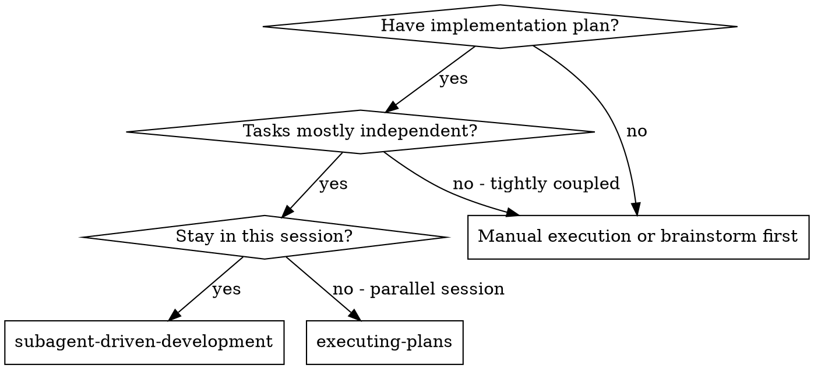
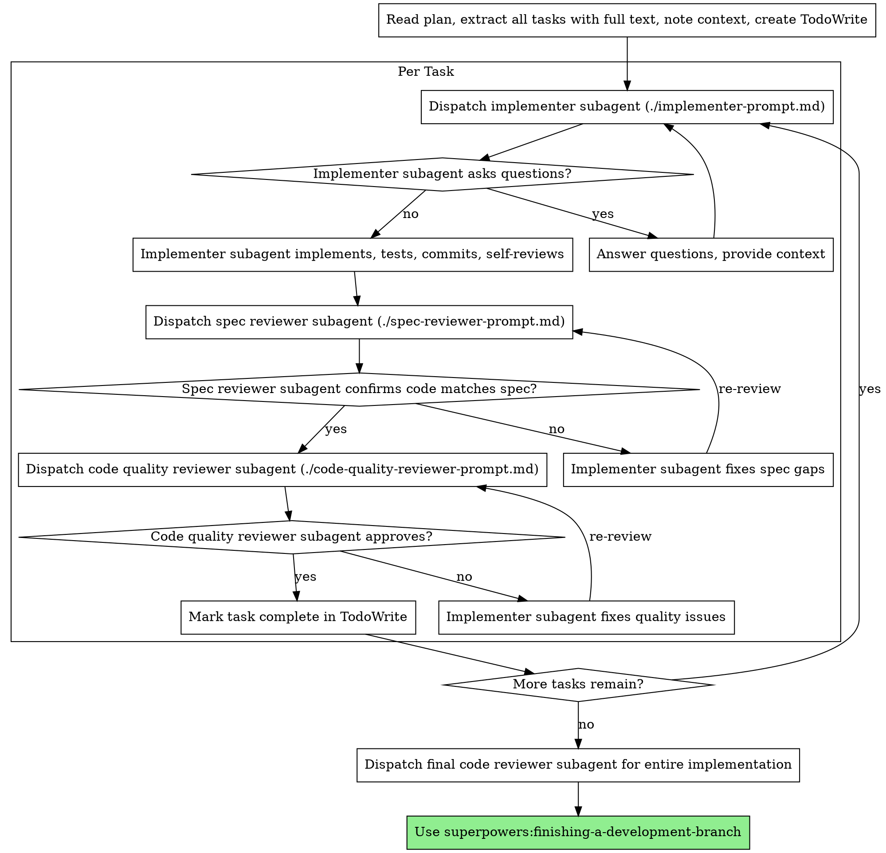

# Subagent-Driven Development

为每个任务 dispatch (分派) 一个新的 subagent 来执行 plan，并在每个任务后进行两阶段审查：先是 spec (规范) 合规性审查，然后是代码质量审查。

**核心原则:** 每个任务一个新的 subagent + 两阶段审查 (spec 然后 quality) = 高质量，快速迭代

## 何时使用 (When to Use)



**vs. Executing Plans (并行会话):**
- 同一会话 (无上下文切换)
- 每个任务一个新的 subagent (无上下文污染)
- 每个任务后进行两阶段审查：先 spec 合规，再代码质量
- 更快的迭代 (任务之间无 artificial loop)

## 流程 (The Process)



## Prompt 模板

- `./implementer-prompt.md` - Dispatch implementer subagent
- `./spec-reviewer-prompt.md` - Dispatch spec compliance reviewer subagent
- `./code-quality-reviewer-prompt.md` - Dispatch code quality reviewer subagent

## 示例工作流

```
You: I'm using Subagent-Driven Development to execute this plan.

[Read plan file once: docs/plans/feature-plan.md]
[Extract all 5 tasks with full text and context]
[Create TodoWrite with all tasks]

Task 1: Hook installation script

[Get Task 1 text and context (already extracted)]
[Dispatch implementation subagent with full task text + context]

Implementer: "Before I begin - should the hook be installed at user or system level?"

You: "User level (~/.config/superpowers/hooks/)"

Implementer: "Got it. Implementing now..."
[Later] Implementer:
  - Implemented install-hook command
  - Added tests, 5/5 passing
  - Self-review: Found I missed --force flag, added it
  - Committed

[Dispatch spec compliance reviewer]
Spec reviewer: ✅ Spec compliant - all requirements met, nothing extra

[Get git SHAs, dispatch code quality reviewer]
Code reviewer: Strengths: Good test coverage, clean. Issues: None. Approved.

[Mark Task 1 complete]

Task 2: Recovery modes

[Get Task 2 text and context (already extracted)]
[Dispatch implementation subagent with full task text + context]

Implementer: [No questions, proceeds]
Implementer:
  - Added verify/repair modes
  - 8/8 tests passing
  - Self-review: All good
  - Committed

[Dispatch spec compliance reviewer]
Spec reviewer: ❌ Issues:
  - Missing: Progress reporting (spec says "report every 100 items")
  - Extra: Added --json flag (not requested)

[Implementer fixes issues]
Implementer: Removed --json flag, added progress reporting

[Spec reviewer reviews again]
Spec reviewer: ✅ Spec compliant now

[Dispatch code quality reviewer]
Code reviewer: Strengths: Solid. Issues (Important): Magic number (100)

[Implementer fixes]
Implementer: Extracted PROGRESS_INTERVAL constant

[Code reviewer reviews again]
Code reviewer: ✅ Approved

[Mark Task 2 complete]

...

[After all tasks]
[Dispatch final code-reviewer]
Final reviewer: All requirements met, ready to merge

Done!
```

## 优势 (Advantages)

**vs. 手动执行:**
- Subagents 自然遵循 TDD
- 每个任务新鲜的上下文 (无混淆)
- 并行安全 (subagents 互不干扰)
- Subagent 可以提问 (在工作之前 和 过程中)

**vs. Executing Plans:**
- 同一会话 (无交接)
- 持续进展 (无等待)
- 自动审查检查点

**效率提升:**
- 无文件读取开销 (controller 提供完整文本)
- Controller 准确策划所需的上下文
- Subagent 预先获得完整信息
- 问题在工作开始前浮现 (而不是之后)

**质量门控:**
- 自我审查在交接之前捕获问题
- 两阶段审查: spec 合规，然后代码质量
- 审查循环确保修复实际有效
- Spec 合规防止过度/不足构建
- 代码质量确保实施构建良好

**成本:**
- 更多 subagent 调用 (每个任务 implementer + 2 reviewers)
- Controller 做更多准备工作 (预先提取所有任务)
- 审查循环增加迭代
- 但尽早发现问题 (比稍后调试更便宜)

## 危险信号 (Red Flags)

**绝不 (Never):**
- 跳过审查 (spec 合规 或 代码质量)
- 在未解决问题的情况下继续
- 并行 dispatch 多个 implementation subagents (冲突)
- 让 subagent 读取 plan 文件 (改为提供完整文本)
- 跳过场景设置上下文 (subagent 需要了解任务适合哪里)
- 忽略 subagent 问题 (在让他们继续之前回答)
- 接受 "close enough" 的 spec 合规性 (spec reviewer 发现问题 = 未完成)
- 跳过审查循环 (reviewer 发现问题 = implementer 修复 = 再次审查)
- 让 implementer 自我审查代替实际审查 (两者都需要)
- **在 spec 合规 ✅ 之前开始代码质量审查** (错误的顺序)
- 在任一审查有未决问题时移动到下一个任务

**如果 subagent 提问:**
- 清晰完整地回答
- 如果需要，提供额外的上下文
- 不要催促他们进入实施

**如果 reviewer 发现问题:**
- Implementer (同一个 subagent) 修复它们
- Reviewer 再次审查
- 重复直到批准
- 不要跳过重新审查

**如果 subagent 任务失败:**
- Dispatch fix subagent 带有具体的指令
- 不要尝试手动修复 (上下文污染)

## 集成 (Integration)

**必需的工作流 skills:**
- **superpowers:writing-plans** - 创建此 skill 执行的 plan
- **superpowers:requesting-code-review** - Reviewer subagents 的 code review 模板
- **superpowers:finishing-a-development-branch** - 所有任务后的完成开发

**Subagents 应该使用:**
- **superpowers:test-driven-development** - Subagents 为每个任务遵循 TDD

**替代工作流:**
- **superpowers:executing-plans** - 用于并行会话而不是同一会话执行
