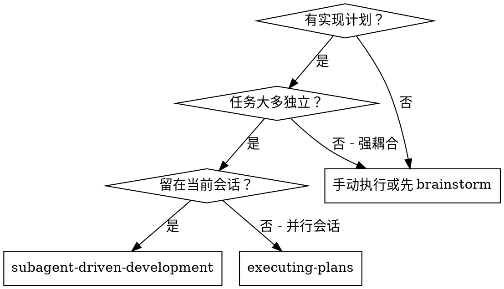
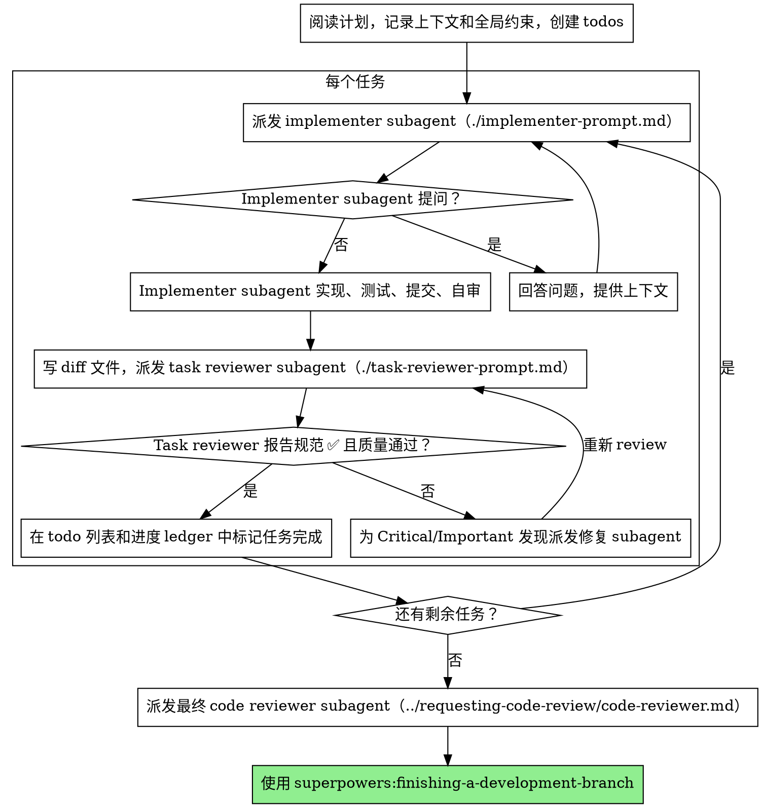

# Subagent-Driven Development（子代理驱动开发）

通过为每个任务派发一个全新的 implementer subagent 来执行计划，每个任务之后进行一次 task review（规范合规 + 代码质量），并在最后进行一次覆盖整个分支的 broad review。

**为什么用 subagent：** 你把任务委托给拥有隔离上下文的专门 agent。通过精确构建它们的指令和上下文，你确保它们保持专注并成功完成各自的任务。它们绝不应该继承你会话的上下文或历史——你精确构造它们所需的内容。这也为你自己的协调工作保留了上下文。

**核心原则：** 每个任务一个全新 subagent + task review（规范 + 质量）+ 最后的 broad review = 高质量、快速迭代

**叙述（Narration）：** 在工具调用之间，至多用一行简短叙述——ledger 和工具结果承载记录。

**持续执行：** 不要在任务之间暂停向你的 human partner 请示。不停顿地执行计划中的所有任务。停止的唯一理由是：你无法解决的 BLOCKED 状态、确实阻碍推进的歧义，或所有任务完成。"我是否继续？"这类提示和进度汇报是在浪费他们的时间——他们让你执行计划，那就执行。

## 何时使用



**对比 Executing Plans（并行会话）：**
- 同一会话（无上下文切换）
- 每个任务一个全新 subagent（无上下文污染）
- 每个任务后进行 review（规范合规 + 代码质量），最后进行 broad review
- 更快迭代（任务之间无需人工介入）

## 流程



## 起飞前计划审查（Pre-Flight Plan Review）

在派发任务 1 之前，把整个计划扫一遍，找出冲突：

- 彼此矛盾、或与计划的全局约束（Global Constraints）矛盾的任务
- 计划明确要求、但被 review 评分标准视为缺陷的任何内容（一个不断言任何东西的测试、一段逐字复制的逻辑块）

把你发现的所有问题作为一个**批量问题**提交给你的 human partner——每个发现放在要求它的那段计划文本旁边，询问以哪个为准——在执行开始前一次性提出，而不是在计划进行中每发现一个就打断一次。如果扫描结果是干净的，无需多言直接推进。review 循环仍然是兜底，捕获那些只有在实现过程中才会浮现的冲突。

## 模型选择（Model Selection）

为每个角色使用能够胜任的、最不强大的模型，以节省成本并提高速度。

**机械性实现任务**（孤立函数、清晰规范、1-2 个文件）：使用快速、便宜的模型。当计划定义良好时，大多数实现任务都是机械的。

**集成和判断任务**（多文件协调、模式匹配、调试）：使用标准模型。

**架构和设计任务**：使用可用的最强大模型。最终的整分支 review 就属于这一类——用可用的最强大模型派发它，而不是会话默认模型。

**审查任务**：选择具有同等判断力的模型，并按 diff 的规模、复杂度和风险来缩放。一个小的机械 diff 不需要最强大的模型；一个微妙的并发改动则需要。

**派发 subagent 时务必显式指定模型。** 省略模型会继承你会话的模型——通常是最强大也最昂贵的——这会无声地使本节失效。

**回合数胜过 token 单价。** 实际耗时和上下文成本随 subagent 走了多少个回合而攀升，而最便宜的模型在多步骤工作上通常要花 2-3 倍的回合——总体成本更高。对 reviewer 以及依据散文描述工作的 implementer，用中端模型作为下限。当任务的计划文本包含了要写的完整代码时，实现工作就是誊抄加测试：对那个 implementer 使用最便宜档次。单文件机械修复也用最便宜档次。

**任务复杂度信号（实现任务）：**
- 触及 1-2 个文件且有完整规范 → 便宜模型
- 触及多个文件且涉及集成 → 标准模型
- 需要设计判断或广泛的代码库理解 → 最强大模型

## 处理 Implementer 状态

Implementer subagent 报告四种状态之一。恰当地处理每一种：

**DONE：** 生成 review 包（`scripts/review-package BASE HEAD`，从本 skill 目录运行——它会打印自己写入的唯一文件路径；BASE 是你派发 implementer 之前记录的 commit——绝不要用 `HEAD~1`，那会无声地丢弃多 commit 任务中除最后一个之外的所有 commit），然后带着打印出的路径派发 task reviewer。

**DONE_WITH_CONCERNS：** Implementer 完成了工作但标记了疑虑。在继续之前阅读这些疑虑。如果疑虑关于正确性或范围，在 review 之前解决它们。如果只是观察性备注（例如"这个文件越来越大了"），记录下来并继续 review。

**NEEDS_CONTEXT：** Implementer 需要未被提供的信息。提供缺失的上下文并重新派发。

**BLOCKED：** Implementer 无法完成任务。评估阻碍因素：
1. 如果是上下文问题，提供更多上下文并以相同模型重新派发
2. 如果任务需要更多推理，以更强大的模型重新派发
3. 如果任务太大，把它拆成更小的片段
4. 如果计划本身是错的，上报给 human

**绝不**无视一个上报，或在没有任何改变的情况下强制同一模型重试。如果 implementer 说它卡住了，那就一定有东西需要改变。

## 处理 Reviewer 的 ⚠️ 项

Task reviewer 可能报告 "⚠️ Cannot verify from diff"（无法从 diff 验证）项——即位于未改动代码中、或跨越多个任务的需求。这些不会阻塞 review 的其余部分，但你必须在标记任务完成之前，自己逐一解决它们：你掌握 reviewer 所缺乏的计划和跨任务上下文。如果你确认某一项确实是缺口，把它当作一次失败的规范 review 处理——退回给 implementer 并重新 review。

## 构建 Reviewer Prompt

每个任务的 review 是任务范围的关卡。broad review 只发生一次，在最终的整分支 review 时。当你填写 reviewer 模板时：

- 不要在没有具体、特定于任务的理由时，添加诸如"检查所有用法"或"如果有用就跑竞态测试"这类开放式指令
- 不要要求 reviewer 重新运行 implementer 已经在相同代码上跑过的测试——implementer 的报告承载测试证据
- 不要替 reviewer 预判发现——绝不指示 reviewer 忽略或不标记某个具体问题。如果你认为某个发现会是误报，让 reviewer 提出它，并在 review 循环中裁决。如果你正在写的 prompt 里包含"不要标记"、"不要把 X 当缺陷"、"最多 Minor"、"计划选择了"——停下：你在预判，通常是为了让自己省掉一轮 review。
- 你交给 reviewer 的全局约束块是它的注意力透镜。从计划的 Global Constraints 小节或规范中逐字复制绑定要求：精确的值、精确的格式，以及组件之间陈述的关系（"与 X 相同的布局"、"匹配 Y"）。reviewer 的模板已经承载了流程规则（YAGNI、测试卫生、review 方法）——约束块是给 THIS 项目的规范所要求的内容。
- 把它的 diff 作为文件交给 reviewer：运行本 skill 的 `scripts/review-package BASE HEAD`，把它打印出的文件路径传给 reviewer（或者，在没有 bash 的情况下：对该范围运行 `git log --oneline`、`git diff --stat` 和 `git diff -U10`，重定向到一个唯一命名的文件）。输出绝不进入你自己的上下文，而 reviewer 一次 Read 就能看到 commit 列表、stat 摘要和带上下文的完整 diff。使用你在派发 implementer 之前记录的 BASE——绝不要用 `HEAD~1`，那会无声地截断多 commit 任务。
- 一次派发 prompt 描述一个任务，而不是会话的历史。不要把累积的过往任务摘要（"任务 1-3 之后的状态"）粘贴进后续派发——一个真实会话的派发达到了 42k 字符，其中 99% 是粘贴的历史。一个全新的 subagent 需要的是它的任务、它触及的接口，以及全局约束。仅此而已。
- 为 Critical 和 Important 发现派发修复 subagent。Minor 发现则边走边记入进度 ledger，并把最终的整分支 review 指向那个列表，让它能分诊哪些必须在合并前修复。一份没人读的汇总就是无声的丢弃。
- 一个被标记为 plan-mandated（计划要求）的发现——或任何与计划文本要求相冲突的发现——是 human 的决定，就像任何计划矛盾一样：把发现和计划文本一并呈现，询问以哪个为准。不要因为计划要求它就驳回发现，也不要在未询问的情况下派发一个与计划相矛盾的修复。
- 最终的整分支 review 也会得到一个包：运行 `scripts/review-package MERGE_BASE HEAD`（MERGE_BASE = 分支起始的 commit，例如 `git merge-base main HEAD`），并在最终 review 派发中包含打印出的路径，这样最终 reviewer 读一个文件即可，而不用用 git 命令重新推导分支 diff。
- 每次修复派发都携带 implementer 契约：修复 subagent 重新运行覆盖其改动的测试并报告结果。在派发中指明覆盖测试文件的名称——一行修复不需要整个测试套件。在重新派发 reviewer 之前，确认修复报告包含覆盖测试、运行的命令和输出；三者齐全后再派发重新 review。
- 如果最终整分支 review 返回了发现，派发**一个**带有完整发现列表的修复 subagent——而不是每个发现一个修复者。每个发现一个修复者各自重建上下文并重跑套件；一个真实会话的最终 review 修复波次，花费超过了它所有任务的总和。

## 文件交接（File Handoffs）

你粘贴进派发 prompt 的一切——以及 subagent 打印回来的一切——都会在会话剩余时间里常驻你的上下文，并在之后每一轮被重新读取。把产物作为文件交接：

- **任务简报（Task brief）：** 在派发 implementer 之前，运行本 skill 的 `scripts/task-brief PLAN_FILE N`——它把任务的完整文本提取到一个唯一命名的文件并打印路径。组织派发内容，让简报保持为需求的唯一来源。你的派发应包含：(1) 一句话说明这个任务在项目中处于什么位置；(2) 简报路径，以"先读这个——它是你的需求，包含要逐字使用的精确值"引入；(3) 简报无法知晓的、来自更早任务的接口和决定；(4) 你在简报中注意到的任何歧义的解决方案；(5) 报告文件路径和报告契约。精确值（数字、魔法字符串、签名、测试用例）只出现在简报中。
- **报告文件（Report file）：** 用简报的命名方式命名 implementer 的报告文件（简报 `…/task-N-brief.md` → 报告 `…/task-N-report.md`），并把它放入派发 prompt。Implementer 在那里写入完整报告，只返回状态、commits、一行测试摘要和疑虑。
- **Reviewer 输入：** task reviewer 得到三个路径——同一个简报文件、报告文件和 review 包——加上绑定该任务的全局约束。
- 修复派发把它们的修复报告（含测试结果）追加到同一个报告文件，并返回简短摘要；重新 review 读取更新后的文件。

## 持久化进度（Durable Progress）

对话记忆无法在压缩（compaction）后存活。在真实会话中，丢失了进度的 controller 曾重新派发整个已完成的任务序列——这是观察到的最昂贵的失败。把进度追踪在 ledger 文件里，而不仅仅在 todos 中。

- 在 skill 开始时，检查是否存在 ledger：`cat "$(git rev-parse --show-toplevel)/.superpowers/sdd/progress.md"`。那里标记为完成的任务是 DONE——不要重新派发它们；在第一个未标记完成的任务处恢复。
- 当一个任务的 review 回来是干净的，在与你其他记账工作相同的消息里，向 ledger 追加一行：`Task N: complete (commits <base7>..<head7>, review clean)`。
- ledger 是你的恢复地图：它点名的 commits 存在于 git 中，即使你的上下文已不记得创建过它们。在压缩之后，信任 ledger 和 `git log`，胜过你自己的回忆。
- `git clean -fdx` 会销毁 ledger（它是 git 忽略的临时文件）；如果发生这种情况，从 `git log` 恢复。

## Prompt 模板

- [implementer-prompt.md](implementer-prompt.md) - 派发 implementer subagent
- [task-reviewer-prompt.md](task-reviewer-prompt.md) - 派发 task reviewer subagent（规范合规 + 代码质量）
- 最终的整分支 review：使用 superpowers:requesting-code-review 的 [code-reviewer.md](../requesting-code-review/code-reviewer.md)

## 示例工作流

```
你：我正在使用 Subagent-Driven Development 来执行这个计划。

[读取计划文件一次：docs/superpowers/plans/feature-plan.md]
[为所有任务创建 todos]

任务 1：Hook 安装脚本

[为任务 1 运行 task-brief；带着简报 + 报告路径 + 上下文派发 implementer]

Implementer："开始之前——hook 应该安装在用户级还是系统级？"

你："用户级（~/.config/superpowers/hooks/）"

Implementer："明白。开始实现..."
[稍后] Implementer：
  - 实现了 install-hook 命令
  - 添加了测试，5/5 通过
  - 自审：发现漏了 --force 标志，已补上
  - 已提交

[运行 review-package，带着打印出的路径派发 task reviewer]
Task reviewer：规范 ✅ - 所有需求都满足，没有多余。
  优点：测试覆盖好，干净。问题：无。任务质量：通过。

[标记任务 1 完成]

任务 2：恢复模式

[为任务 2 运行 task-brief；带着简报 + 报告路径 + 上下文派发 implementer]

Implementer：[没有问题，继续]
Implementer：
  - 添加了 verify/repair 模式
  - 8/8 测试通过
  - 自审：一切良好
  - 已提交

[运行 review-package，带着打印出的路径派发 task reviewer]
Task reviewer：规范 ❌：
  - 缺失：进度报告（规范说"每 100 项报告一次"）
  - 多余：添加了 --json 标志（未被要求）
  问题（Important）：魔法数字（100）

[带着所有发现派发修复 subagent]
Fixer：移除了 --json 标志，添加了进度报告，提取了 PROGRESS_INTERVAL 常量

[Task reviewer 再次 review]
Task reviewer：规范 ✅。任务质量：通过。

[标记任务 2 完成]

...

[所有任务之后]
[派发最终 code-reviewer]
最终 reviewer：所有需求都满足，可以合并

完成！
```

## 优势

**对比手动执行：**
- Subagent 自然遵循 TDD
- 每个任务全新上下文（无混淆）
- 并行安全（subagent 互不干扰）
- Subagent 可以提问（工作前和工作期间都可以）

**对比 Executing Plans：**
- 同一会话（无交接）
- 持续推进（无需等待）
- review 检查点自动化

**效率提升：**
- Controller 精确筛选所需的上下文；大批量产物以文件形式流动，而非粘贴的文本
- Subagent 预先获得完整信息
- 问题在工作开始前（而非之后）浮现

**质量关卡：**
- 自审在交接前捕获问题
- Task review 携带两个裁决：规范合规和代码质量
- review 循环确保修复真正生效
- 规范合规防止过度/不足构建
- 代码质量确保实现构建良好

**成本：**
- 更多 subagent 调用（每个任务 implementer + reviewer）
- Controller 做更多准备工作（预先提取所有任务）
- review 循环增加迭代
- 但早早捕获问题（比之后调试更便宜）

## 危险信号（Red Flags）

**绝不：**
- 在没有用户明确同意的情况下，在 main/master 分支上开始实现
- 跳过 task review，或接受缺少任一裁决的报告（规范合规和任务质量两者都是必需的）
- 带着未修复的问题继续
- 并行派发多个实现 subagent（会冲突）
- 让 subagent 读取整个计划文件（改交给它任务简报——`scripts/task-brief`）
- 跳过背景设定上下文（subagent 需要理解任务所处的位置）
- 忽略 subagent 的问题（让它们继续之前先回答）
- 在规范合规上接受"差不多就行"（reviewer 发现了规范问题 = 未完成）
- 跳过 review 循环（reviewer 发现问题 = implementer 修复 = 再次 review）
- 让 implementer 的自审取代真正的 review（两者都需要）
- 告诉 reviewer 不要标记什么，或在派发 prompt 中预判某个发现的严重度（"最多当作 Minor"）——计划的示例代码是起点，不是它的弱点是被选定的证据
- 在没有 diff 文件的情况下派发 task reviewer——先生成它（`scripts/review-package BASE HEAD`），并在 prompt 中指明打印出的路径
- 在 review 还有未解决的 Critical/Important 问题时进入下一个任务
- 重新派发进度 ledger 已标记为完成的任务——在任何压缩或恢复之后检查 ledger（以及 `git log`）

**如果 subagent 提问：**
- 清晰完整地回答
- 如有需要提供额外上下文
- 不要催促它们进入实现

**如果 reviewer 发现问题：**
- Implementer（同一个 subagent）修复它们
- Reviewer 再次 review
- 重复直到通过
- 不要跳过重新 review

**如果 subagent 任务失败：**
- 派发带有具体指令的修复 subagent
- 不要尝试手动修复（会污染上下文）

## 集成

**必需的工作流 skills：**
- **superpowers:using-git-worktrees** - 确保隔离工作区（创建一个或验证已存在）
- **superpowers:writing-plans** - 创建本 skill 执行的计划
- **superpowers:requesting-code-review** - 用于最终整分支 review 的代码审查模板
- **superpowers:finishing-a-development-branch** - 在所有任务之后完成开发

**Subagent 应使用：**
- **superpowers:test-driven-development** - Subagent 为每个任务遵循 TDD

**替代工作流：**
- **superpowers:executing-plans** - 用于并行会话，而非同会话执行
