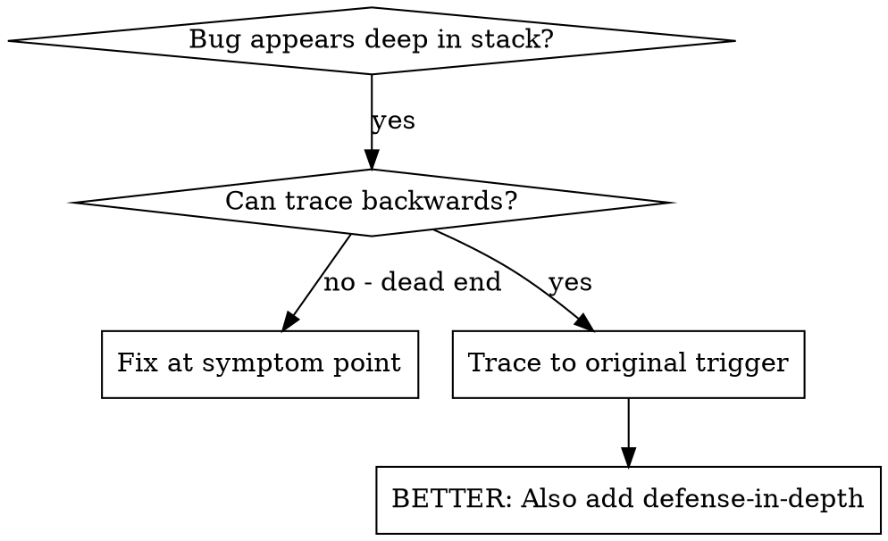
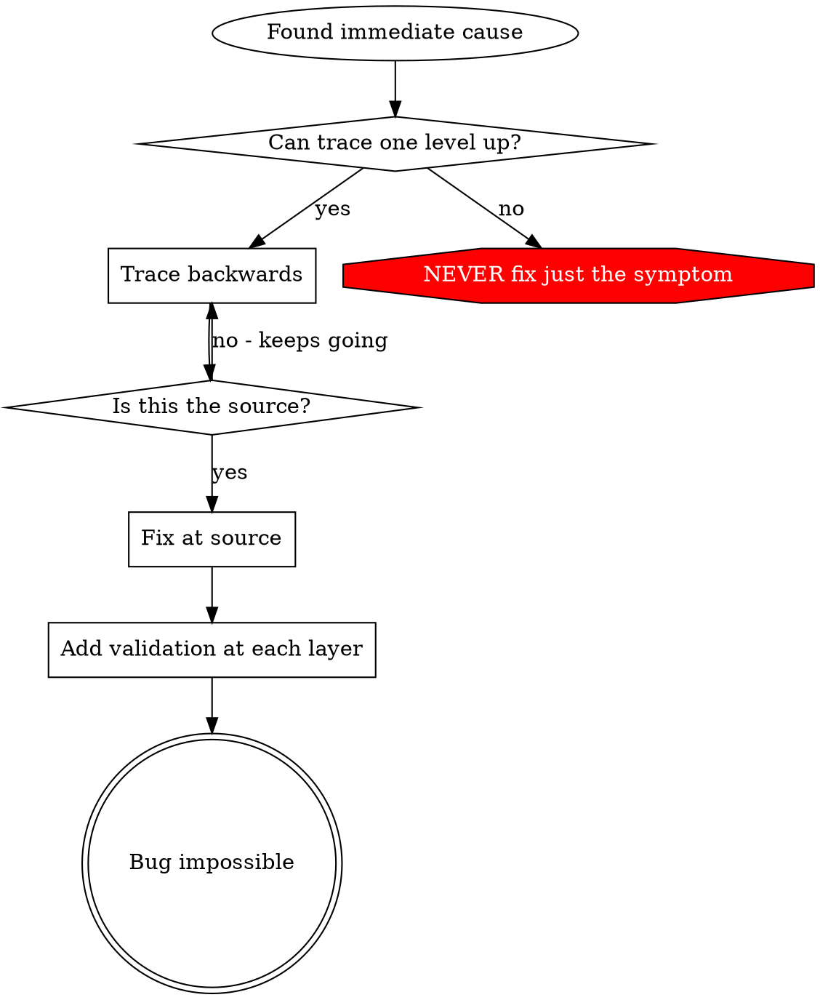

# Root Cause Tracing (根本原因追踪)

## 概述 (Overview)

Bugs 经常出现在调用堆栈深处（git init 在错误的目录，文件创建在错误的位置，数据库用错误的路径打开）。你的本能是修复错误出现的地方，但那只是治标不治本。

**核心原则:** 向后追踪调用链，直到找到原始触发器，然后在源头修复。

## 何时使用 (When to Use)



**使用场景:**
- 错误发生在执行深处（不是在入口点）
- Stack trace 显示长调用链
- 不清楚无效数据源自哪里
- 需要找到哪个测试/代码触发了问题

## 追踪流程 (The Tracing Process)

### 1. 观察症状
```
Error: git init failed in ~/project/packages/core
```

### 2. 找到直接原因
**什么代码直接导致了这个？**
```typescript
await execFileAsync('git', ['init'], { cwd: projectDir });
```

### 3. 询问: 什么调用了这个？
```typescript
WorktreeManager.createSessionWorktree(projectDir, sessionId)
  → called by Session.initializeWorkspace()
  → called by Session.create()
  → called by test at Project.create()
```

### 4. 继续向上追踪
**传递了什么值？**
- `projectDir = ''` (空字符串!)
- 空字符串作为 `cwd` 解析为 `process.cwd()`
- 那是源代码目录！

### 5. 找到原始触发器
**空字符串从何而来？**
```typescript
const context = setupCoreTest(); // Returns { tempDir: '' }
Project.create('name', context.tempDir); // Accessed before beforeEach!
```

## 添加 Stack Traces

当你无法手动追踪时，添加插桩代码 (instrumentation):

```typescript
// Before the problematic operation
async function gitInit(directory: string) {
  const stack = new Error().stack;
  console.error('DEBUG git init:', {
    directory,
    cwd: process.cwd(),
    nodeEnv: process.env.NODE_ENV,
    stack,
  });

  await execFileAsync('git', ['init'], { cwd: directory });
}
```

**关键:** 在测试中使用 `console.error()` (不是 logger - 可能不会显示)

**运行并捕获:**
```bash
npm test 2>&1 | grep 'DEBUG git init'
```

**分析 stack traces:**
- 寻找测试文件名
- 找到触发调用的行号
- 识别模式（相同的测试？相同的参数？）

## 找到哪个测试导致污染

如果某事在测试期间出现，但你不知道是哪个测试:

使用此目录下的二分脚本 `find-polluter.sh`:

```bash
./find-polluter.sh '.git' 'src/**/*.test.ts'
```

逐个运行测试，在第一个污染者处停止。查看脚本了解用法。

## 真实示例: 空 projectDir

**症状:** `.git` 在 `packages/core/` (源代码) 中创建

**追踪链:**
1. `git init` 在 `process.cwd()` 中运行 ← 空 cwd 参数
2. WorktreeManager 被调用，带有空 projectDir
3. Session.create() 传递了空字符串
4. 测试在 beforeEach 之前访问了 `context.tempDir`
5. setupCoreTest() 最初返回 `{ tempDir: '' }`

**根本原因:** 顶层变量初始化访问了空值

**修复:** 使 tempDir 变为 getter，如果在 beforeEach 之前访问则抛出异常

**还添加了纵深防御:**
- Layer 1: Project.create() 验证目录
- Layer 2: WorkspaceManager 验证非空
- Layer 3: NODE_ENV 守卫拒绝 tmpdir 之外的 git init
- Layer 4: git init 之前的 Stack trace 日志

## 关键原则 (Key Principle)



**绝不要只修复错误出现的地方。** 追溯回去找到原始触发器。

## Stack Trace 技巧

**在测试中:** 使用 `console.error()` 而不是 logger - logger 可能会被抑制
**操作前:** 在危险操作之前记录，而不是在失败之后
**包含上下文:** 目录, cwd, 环境变量, 时间戳
**捕获堆栈:** `new Error().stack` 显示完整的调用链

## 真实世界影响

来自调试会话 (2025-10-03):
- 通过 5 级追踪找到根本原因
- 在源头修复 (getter 验证)
- 添加了 4 层防御
- 1847 个测试通过，零污染
