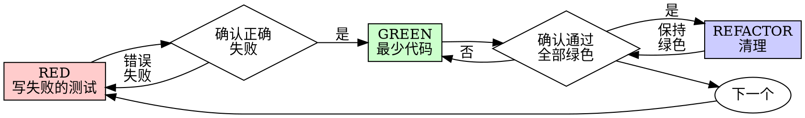

# Test-Driven Development / 测试驱动开发（TDD）

## 概览

先写测试。看它失败。写最少的代码让它通过。

**核心原则：** 如果你没有看到测试失败，你就不知道它是否测对了东西。

**违反规则的字面意义，就是违反规则的精神。**

## 何时使用

**始终：**
- 新功能
- Bug 修复
- 重构
- 行为变更

**例外（询问你的 human partner）：**
- 一次性原型
- 生成的代码
- 配置文件

在想"就这一次跳过 TDD"？停下。那是自我合理化。

## 铁律

```
没有先写出失败的测试，就不写任何生产代码
```

先写代码再写测试？删掉它。从头来。

**没有例外：**
- 不要把它留作"参考"
- 不要在写测试时"改编"它
- 不要看它
- 删除就是删除

从测试出发重新实现。到此为止。

## Red-Green-Refactor



### RED - 写失败的测试

写一个最简测试，展示应当发生什么。

<Good>
```typescript
test('retries failed operations 3 times', async () => {
  let attempts = 0;
  const operation = () => {
    attempts++;
    if (attempts < 3) throw new Error('fail');
    return 'success';
  };

  const result = await retryOperation(operation);

  expect(result).toBe('success');
  expect(attempts).toBe(3);
});
```
名字清晰，测试真实行为，只测一件事
</Good>

<Bad>
```typescript
test('retry works', async () => {
  const mock = jest.fn()
    .mockRejectedValueOnce(new Error())
    .mockRejectedValueOnce(new Error())
    .mockResolvedValueOnce('success');
  await retryOperation(mock);
  expect(mock).toHaveBeenCalledTimes(3);
});
```
名字含糊，测的是 mock 而不是代码
</Bad>

**要求：**
- 一个行为
- 清晰的名字
- 真实代码（除非不可避免，否则不用 mock）

### 验证 RED - 看它失败

**必须做。绝不跳过。**

```bash
npm test path/to/test.test.ts
```

确认：
- 测试失败（不是报错）
- 失败信息符合预期
- 因为功能缺失而失败（不是笔误）

**测试通过了？** 你在测试已存在的行为。修改测试。

**测试报错了？** 修复错误，重新运行，直到它正确失败。

### GREEN - 最少代码

写最简单的代码通过测试。

<Good>
```typescript
async function retryOperation<T>(fn: () => Promise<T>): Promise<T> {
  for (let i = 0; i < 3; i++) {
    try {
      return await fn();
    } catch (e) {
      if (i === 2) throw e;
    }
  }
  throw new Error('unreachable');
}
```
刚好够通过
</Good>

<Bad>
```typescript
async function retryOperation<T>(
  fn: () => Promise<T>,
  options?: {
    maxRetries?: number;
    backoff?: 'linear' | 'exponential';
    onRetry?: (attempt: number) => void;
  }
): Promise<T> {
  // YAGNI
}
```
过度设计
</Bad>

不要添加功能、重构其他代码，或"改进"超出测试范围的东西。

### 验证 GREEN - 看它通过

**必须做。**

```bash
npm test path/to/test.test.ts
```

确认：
- 测试通过
- 其他测试仍然通过
- 输出干净（无错误、无警告）

**测试失败了？** 修复代码，而不是测试。

**其他测试失败了？** 立即修复。

### REFACTOR - 清理

仅在绿色之后：
- 移除重复
- 改进命名
- 提取辅助函数

保持测试为绿色。不要添加行为。

### 重复

下一个失败测试，用于下一个功能。

## 好的测试

| 质量 | 好 | 坏 |
|---------|------|-----|
| **最小** | 只测一件事。名字里有"and"？拆开它。 | `test('validates email and domain and whitespace')` |
| **清晰** | 名字描述行为 | `test('test1')` |
| **体现意图** | 展示期望的 API | 掩盖了代码应当做什么 |

## 为什么顺序重要

**"我之后再写测试来验证它有效"**

在代码之后写的测试会立即通过。立即通过什么也证明不了：
- 可能测错了东西
- 可能测的是实现，而不是行为
- 可能遗漏了你忘记的边界情况
- 你从未看到它捕获到 bug

测试先行强迫你看到测试失败，证明它确实在测试某些东西。

**"我已经手动测试了所有边界情况"**

手动测试是随性的。你以为测试了一切，但是：
- 没有记录你测试了什么
- 代码变更时无法重新运行
- 压力下容易忘记某些情况
- "我试过的时候它能用" ≠ 全面

自动化测试是系统化的。它们每次都以相同方式运行。

**"删掉 X 小时的工作是浪费"**

沉没成本谬误。时间已经花掉了。你现在的选择是：
- 删掉并用 TDD 重写（再花 X 小时，高置信度）
- 保留它并在之后补测试（30 分钟，低置信度，很可能有 bug）

真正的"浪费"是保留你无法信任的代码。没有真实测试的可运行代码就是技术债。

**"TDD 是教条主义，务实意味着要变通"**

TDD 就是务实的：
- 在提交前发现 bug（比事后调试更快）
- 防止回归（测试立即捕获破坏）
- 文档化行为（测试展示如何使用代码）
- 支持重构（自由地改，测试捕获破坏）

"务实"的捷径 = 在生产环境调试 = 更慢。

**"后置测试能达到同样目标——重要的是精神而不是仪式"**

不。后置测试回答"这做了什么？"先行测试回答"这应当做什么？"

后置测试受你的实现偏见影响。你测试的是你构建的东西，而不是需求。你验证的是你记得的边界情况，而不是发现的边界情况。

先行测试强迫你在实现之前发现边界情况。后置测试验证你记住了一切（你并没有）。

30 分钟的后置测试 ≠ TDD。你得到了覆盖率，却失去了测试有效的证明。

## 常见合理化借口

| 借口 | 现实 |
|--------|---------|
| "太简单了，不需要测试" | 简单代码也会出错。测试只要 30 秒。 |
| "我之后再测" | 立即通过的测试什么都证明不了。 |
| "后置测试能达到同样目标" | 后置测试 = "这做了什么？" 先行测试 = "这应当做什么？" |
| "已经手动测试过了" | 随性 ≠ 系统化。无记录，无法重新运行。 |
| "删掉 X 小时是浪费" | 沉没成本谬误。保留未验证的代码才是技术债。 |
| "留作参考，先写测试" | 你会去改编它。那就是后置测试。删除就是删除。 |
| "需要先探索" | 可以。但扔掉探索成果，用 TDD 从头开始。 |
| "测试很难写 = 设计不清楚" | 倾听测试。难测试 = 难使用。 |
| "TDD 会拖慢我" | TDD 比调试更快。务实 = 测试先行。 |
| "手动测试更快" | 手动测试无法证明边界情况。每次变更都要重新测试。 |
| "现有代码没有测试" | 你在改进它。为现有代码添加测试。 |

## 危险信号（Red Flags）- 停下并从头来

- 先有代码后有测试
- 实现之后才写测试
- 测试立即通过
- 无法解释测试为什么失败
- 测试"以后再补"
- 合理化"就这一次"
- "我已经手动测试过了"
- "后置测试能达到同样目的"
- "重要的是精神而不是仪式"
- "留作参考"或"改编现有代码"
- "已经花了 X 小时，删掉是浪费"
- "TDD 是教条主义，我是务实的"
- "这次不一样，因为……"

**以上所有都意味着：删除代码。用 TDD 从头来。**

## 示例：Bug 修复

**Bug：** 空邮箱被接受

**RED**
```typescript
test('rejects empty email', async () => {
  const result = await submitForm({ email: '' });
  expect(result.error).toBe('Email required');
});
```

**验证 RED**
```bash
$ npm test
FAIL: expected 'Email required', got undefined
```

**GREEN**
```typescript
function submitForm(data: FormData) {
  if (!data.email?.trim()) {
    return { error: 'Email required' };
  }
  // ...
}
```

**验证 GREEN**
```bash
$ npm test
PASS
```

**REFACTOR**
如有需要，为多个字段提取校验逻辑。

## 验证清单

在标记工作完成之前：

- [ ] 每个新函数/方法都有一个测试
- [ ] 在实现之前看到了每个测试失败
- [ ] 每个测试因预期原因而失败（功能缺失，而非笔误）
- [ ] 写了最少的代码让每个测试通过
- [ ] 所有测试通过
- [ ] 输出干净（无错误、无警告）
- [ ] 测试使用真实代码（仅在不可避免时才用 mock）
- [ ] 覆盖了边界情况和错误

无法勾选所有框？你跳过了 TDD。从头来。

## 遇到困难时

| 问题 | 解决方案 |
|---------|----------|
| 不知道怎么测试 | 写下你期望的 API。先写断言。问你的 human partner。 |
| 测试太复杂 | 设计太复杂。简化接口。 |
| 必须 mock 一切 | 代码耦合太重。使用依赖注入。 |
| 测试设置庞大 | 提取辅助函数。仍然复杂？简化设计。 |

## 调试集成

发现了 bug？写一个能复现它的失败测试。遵循 TDD 循环。测试证明了修复，并防止回归。

绝不写没有测试的 bug 修复。

## 测试反模式

当添加 mock 或测试工具时，阅读 [testing-anti-patterns.md](testing-anti-patterns.md) 以避免常见陷阱：
- 测试 mock 行为而不是真实行为
- 给生产类添加仅供测试的方法
- 在不理解依赖的情况下使用 mock

## 最终规则

```
生产代码 → 测试存在且先失败
否则 → 不是 TDD
```

未经你的 human partner 许可，没有例外。
