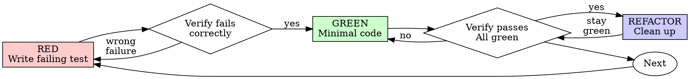

# Test-Driven Development (TDD)

## 概述 (Overview)

首先编写测试。看着它失败。编写最少量的代码使其通过。

**核心原则:** 如果你没有看着测试失败，你就不知道它是否测试了正确的东西。

**违反规则的字面意思就是违反规则的精神。**

## 何时使用 (When to Use)

**总是 (Always):**
- 新功能
- Bug 修复
- 重构
- 行为改变

**例外 (询问你的人类伙伴):**
- 随用随弃的原型
- 生成的代码
- 配置文件

想 "就这一次通过 TDD"？停下。那是借口。

## 铁律 (The Iron Law)

```
没有先失败的测试就没有生产代码 (NO PRODUCTION CODE WITHOUT A FAILING TEST FIRST)
```

在测试之前写代码？删除它。重新开始。

**无例外:**
- 不要将其保留为 "参考"
- 不要在编写测试时 "改编" 它
- 不要看它
- 删除意味着删除

从测试中全新实施。句号。

## Red-Green-Refactor



### RED - 编写失败的测试

编写一个展示应该发生什么的最小测试。

<Good>
```typescript
test('retries failed operations 3 times', async () => {
  let attempts = 0;
  const operation = () => {
    attempts++;
    if (attempts < 3) throw new Error('fail');
    return 'success';
  };

  const result = await retryOperation(operation);

  expect(result).toBe('success');
  expect(attempts).toBe(3);
});
```
清晰的名称，测试真实行为，一件事
</Good>

<Bad>
```typescript
test('retry works', async () => {
  const mock = jest.fn()
    .mockRejectedValueOnce(new Error())
    .mockRejectedValueOnce(new Error())
    .mockResolvedValueOnce('success');
  await retryOperation(mock);
  expect(mock).toHaveBeenCalledTimes(3);
});
```
模糊的名称，测试 mock 而不是代码
</Bad>

**要求:**
- 一个行为
- 清晰的名称
- 真实代码 (除非不可避免，否则无 mocks)

### Verify RED - 看着它失败

**强制性。绝不跳过。**

```bash
npm test path/to/test.test.ts
```

确认:
- 测试失败 (不是错误)
- 失败信息是预期的
- 失败是因为功能缺失 (不是拼写错误)

**测试通过？** 你在测试现有行为。修复测试。

**测试错误？** 修复错误，重新运行直到它正确失败。

### GREEN - 最小代码

编写最简单的代码通过测试。

<Good>
```typescript
async function retryOperation<T>(fn: () => Promise<T>): Promise<T> {
  for (let i = 0; i < 3; i++) {
    try {
      return await fn();
    } catch (e) {
      if (i === 2) throw e;
    }
  }
  throw new Error('unreachable');
}
```
刚好足够通过
</Good>

<Bad>
```typescript
async function retryOperation<T>(
  fn: () => Promise<T>,
  options?: {
    maxRetries?: number;
    backoff?: 'linear' | 'exponential';
    onRetry?: (attempt: number) => void;
  }
): Promise<T> {
  // YAGNI
}
```
过度设计
</Bad>

不要添加功能，重构其他代码，或在测试之外 "改进"。

### Verify GREEN - 看着它通过

**强制性。**

```bash
npm test path/to/test.test.ts
```

确认:
- 测试通过
- 其他测试仍然通过
- 输出干净 (无错误、警告)

**测试失败？** 修复代码，而不是测试。

**其他测试失败？** 现在修复。

### REFACTOR - 清理

仅在 green 后:
- 移除重复
- 改进命名
- 提取 auxiliary (辅助函数/helpers)

保持测试 green。不要添加行为。

### 重复 (Repeat)

下一个功能的下一个失败测试。

## 好的测试 (Good Tests)

| 质量 | 好 | 坏 |
|---------|------|-----|
| **最小** | 一件事。名称中有 "and"？拆分它。 | `test('validates email and domain and whitespace')` |
| **清晰** | 名称描述行为 | `test('test1')` |
| **显示意图** | 演示所需的 API | 模糊了代码应该做什么 |

## 为什么顺序很重要

**"稍后我会写测试来验证它的工作"**

代码后写的测试立即通过。立即通过证明不了什么:
- 可能测试了错误的东西
- 可能测试了实施，而不是行为
- 可能错过了你忘记的边界情况
- 你从未见过它捕获 bug

先测试迫使你看到测试失败，证明它实际上测试了一些东西。

**"我已经手动测试了所有的边界情况"**

手动测试是临时的。你认为你测试了一切，但是:
- 没有你测试内容的记录
- 代码更改时无法重新运行
- 在压力下容易忘记情况
- "我试过时它有效" ≠ 全面

自动化测试是系统的。它们每次都以相同的方式运行。

**"删除 X 小时的工作是浪费"**

沉没成本谬误。时间已经过去了。你现在的选择:
- 删除并用 TDD 重写 (再花 X 小时，高信心)
- 保留它并在之后添加测试 (30 分钟，低信心，可能有 bugs)

"浪费" 是保留你不能信任的代码。没有真实测试的工作代码是技术债务。

**"TDD 是教条主义，务实意味着适应"**

TDD **就是**务实的:
- 在 commit 前发现 bugs (比之后调试更快)
- 防止回归 (测试立即捕获破坏)
- 记录行为 (测试展示如何使用代码)
- 启用重构 (自由更改，测试捕获破坏)

"务实" 捷径 = 生产中调试 = 更慢。

**"后测试达到相同的目标 - 它是精神而不是仪式"**

不。后测试回答 "这做什么？"。先测试回答 "这应该做什么？"。

后测试受你的实施偏见影响。你测试你构建的，而不是需要的。你验证记住的边界情况，而不是发现的。

先测试迫使在实施之前发现边界情况。后测试验证你记住了所有事情 (你没有)。

30 分钟的后测试 ≠ TDD。你获得了覆盖率，失去了测试工作的证明。

## 常见借口 (Common Rationalizations)

| 借口 | 现实 |
|--------|---------|
| "太简单不用测试" | 简单代码会坏。测试只需 30 秒。 |
| "我会之后测试" | 立即通过的测试证明不了什么。 |
| "后测试达到相同目标" | 后测试 = "这做什么？" 先测试 = "这应该做什么？" |
| "已经手动测试过" | 临时 ≠ 系统。无记录，无法重新运行。 |
| "删除 X 小时是浪费" | 沉没成本谬误。保留未验证的代码是技术债务。 |
| "保留作为参考，先写测试" | 你会改编它。那就是后测试。删除意味着删除。 |
| "需要先探索" | 好的。扔掉探索，用 TDD 开始。 |
| "测试难 = 设计不清楚" | 倾听测试。难以测试 = 难以使用。 |
| "TDD 会拖慢我" | TDD 比调试快。务实 = 先测试。 |
| "手动测试更快" | 手动不能证明边界情况。你会重新测试每个更改。 |
| "现有代码没有测试" | 你正在改进它。为现有代码添加测试。 |

## 危险信号 - 停止并重新开始

- 测试前的代码
- 实施后的测试
- 测试立即通过
- 无法解释测试为什么失败
- 测试 "稍后" 添加
- 合理化 "就这一次"
- "我已经手动测试过了"
- "后测试达到相同的目的"
- "这是关于精神而不是仪式"
- "保留作为参考" 或 "改编现有代码"
- "已经花了 X 小时，删除是浪费"
- "TDD 是教条主义，我是务实的"
- "这不同因为..."

**所有这些意味着: 删除代码。用 TDD 重新开始。**

## 示例: Bug 修复

**Bug:** 接受空电子邮件

**RED**
```typescript
test('rejects empty email', async () => {
  const result = await submitForm({ email: '' });
  expect(result.error).toBe('Email required');
});
```

**Verify RED**
```bash
$ npm test
FAIL: expected 'Email required', got undefined
```

**GREEN**
```typescript
function submitForm(data: FormData) {
  if (!data.email?.trim()) {
    return { error: 'Email required' };
  }
  // ...
}
```

**Verify GREEN**
```bash
$ npm test
PASS
```

**REFACTOR**
如果需要，提取多个字段的验证。

## 验证清单 (Verification Checklist)

在标记工作完成之前:

- [ ] 每个新函数/方法都有测试
- [ ] 在实施之前看着每个测试失败
- [ ] 每个测试因预期原因失败 (功能缺失，不是拼写错误)
- [ ] 编写通过每个测试的最少代码
- [ ] 所有测试通过
- [ ] 输出干净 (无错误、警告)
- [ ] 测试使用真实代码 (除非不可避免，否则仅 mocks)
- [ ] 覆盖了边界情况和错误

不能选中所有框？你跳过了 TDD。重新开始。

## 受阻时 (When Stuck)

| 问题 | 解决方案 |
|---------|----------|
| 不知道如何测试 | 写下希望的 API。先写断言。询问你的人类伙伴。 |
| 测试太复杂 | 设计太复杂。简化接口。 |
| 必须 mock 一切 | 代码耦合太紧。使用依赖注入。 |
| 测试设置巨大 | 提取 helpers。仍然复杂？简化设计。 |

## 调试集成

发现 Bug？编写复现它的失败测试。遵循 TDD 循环。测试证明修复并防止回归。

绝不要在没有测试的情况下修复 bugs。

## Testing Anti-Patterns

当添加 mocks 或测试工具时，阅读 @testing-anti-patterns.md 以避免常见陷阱:
- 测试 mock 行为而不是真实行为
- 在生产类中添加仅测试用方法
- 在不了解依赖关系的情况下 Mocking

## 最终规则 (Final Rule)

```
生产代码 → 测试存在并先失败
否则 → 不是 TDD
```

没有你的人类伙伴的许可，无例外。
