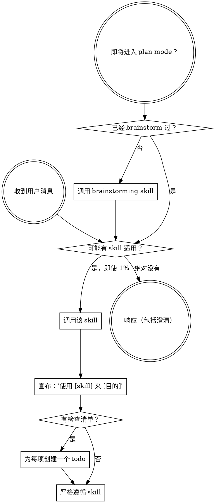

<SUBAGENT-STOP>
如果你是作为 subagent 被派发来执行特定任务，跳过此 skill。
</SUBAGENT-STOP>

<EXTREMELY-IMPORTANT>
如果你认为即使只有 1% 的机会某个 skill 可能适用于你正在做的事情，你**绝对必须**调用该 skill。

如果某个 skill 适用于你的任务，你没有选择。你必须使用它。

这不可协商。这不是可选项。你无法通过自我合理化来逃避这一点。
</EXTREMELY-IMPORTANT>

## 指令优先级

Superpowers skills 会覆盖默认的系统提示行为，但**用户指令始终优先**：

1. **用户的显式指令**（CLAUDE.md、GEMINI.md、AGENTS.md、直接请求）——最高优先级
2. **Superpowers skills**——在冲突时覆盖默认系统行为
3. **默认系统提示**——最低优先级

如果 CLAUDE.md、GEMINI.md 或 AGENTS.md 说"不要使用 TDD"，而某个 skill 说"始终使用 TDD"，请遵循用户指令。用户拥有控制权。

## 如何访问 Skills

**绝不使用文件工具手动读取 skill 文件**——始终使用你所在平台的 skill 加载机制，这样 skill 才能被正确激活。

**在 Claude Code 中：** 使用 `Skill` 工具。当你调用一个 skill 时，其内容会被加载并呈现给你——直接遵循它。

**在 Codex 中：** Skills 原生加载。遵循 skill 激活时呈现的指令。

**在 Copilot CLI 中：** 使用 `skill` 工具。Skills 从已安装的插件中自动发现。

**在 Gemini CLI 中：** Skills 通过 `activate_skill` 工具激活。Gemini 在会话开始时加载 skill 元数据，并按需激活完整内容。

**在其他环境中：** 查阅你所在平台的文档，了解 skills 如何加载。

## 平台适配

Skills 以动作表述（"派发一个 subagent"、"创建一个 todo"、"读取一个文件"），而不是命名某个特定运行时的工具。有关各平台的工具等价物和指令文件约定，请参见 [claude-code-tools.md](references/claude-code-tools.md)、[codex-tools.md](references/codex-tools.md)、[copilot-tools.md](references/copilot-tools.md)、[gemini-tools.md](references/gemini-tools.md)、[pi-tools.md](references/pi-tools.md) 和 [antigravity-tools.md](references/antigravity-tools.md)。Gemini CLI 用户通过 GEMINI.md 自动加载工具映射。

# 使用 Skills

## 规则

**在任何响应或动作之前，调用相关或被请求的 skills。** 即使只有 1% 的机会某个 skill 可能适用，也意味着你应该调用该 skill 来检查。如果调用的 skill 事后证明不适合当前情况，你不需要使用它。

## 危险信号（Red Flags）

这些想法意味着停下——你在自我合理化：

| 想法 | 现实 |
|---------|---------|
| "这只是个简单问题" | 问题也是任务。检查是否有适用的 skill。 |
| "我需要先了解更多上下文" | skill 检查发生在提出澄清问题之前。 |
| "让我先探索一下代码库" | Skills 告诉你如何探索。先检查。 |
| "我可以快速检查 git/文件" | 文件缺少对话上下文。检查是否有适用的 skill。 |
| "让我先收集信息" | Skills 告诉你如何收集信息。 |
| "这不需要正式的 skill" | 如果存在适用的 skill，就使用它。 |
| "我记得这个 skill" | Skills 会演进。阅读当前版本。 |
| "这算不上一个任务" | 动作 = 任务。检查是否有适用的 skill。 |
| "这个 skill 小题大做了" | 简单的事情会变复杂。使用它。 |
| "我先只做这一件事" | 在做任何事之前先检查。 |
| "这感觉很高效" | 无纪律的行动会浪费时间。Skills 能防止这种情况。 |
| "我知道那是什么意思" | 知道概念 ≠ 使用 skill。调用它。 |

## Skill 优先级

当多个 skills 可能适用时，使用此顺序：

1. **流程 skills 优先**（brainstorming、systematic-debugging）——这些决定如何着手任务
2. **实现 skills 其次**（frontend-design、mcp-builder）——这些指导执行

"让我们构建 X" → 先 brainstorming，再实现 skills。
"修复这个 bug" → 先 systematic-debugging，再领域特定 skills。

## Skill 类型

**刚性**（TDD、systematic-debugging）：严格遵循。不要为了省事而放弃纪律。

**柔性**（模式）：将原则适配到具体情境。

skill 本身会告诉你它属于哪种。

## 用户指令

指令说明做什么（WHAT），不是怎么做（HOW）。"添加 X"或"修复 Y"并不意味着跳过工作流。
