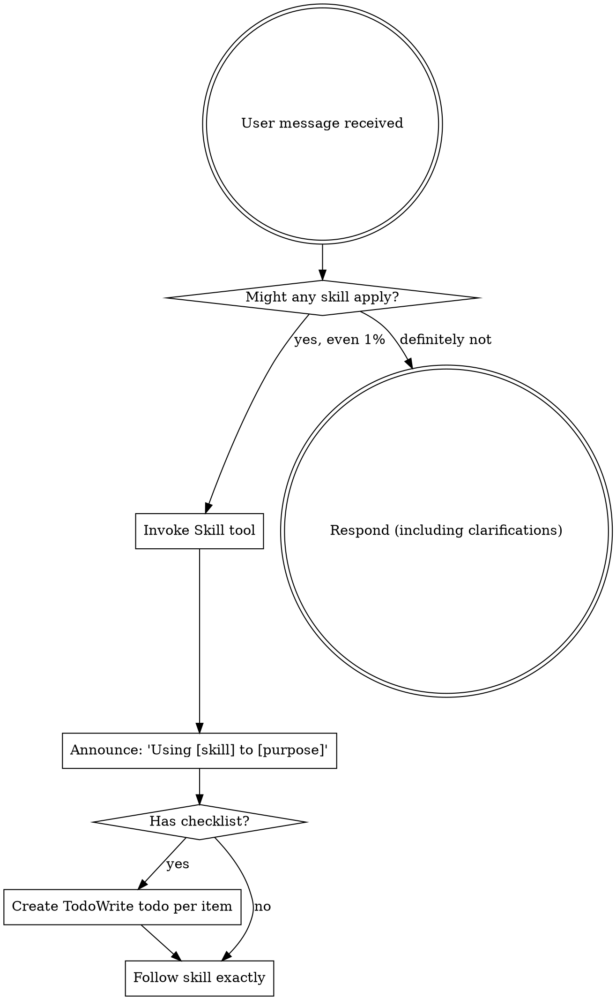

<EXTREMELY-IMPORTANT>
如果你认为即使只有 1% 的机会某个 skill 可能适用于你正在做的事情，你**绝对必须**调用该 skill。

如果一个 SKILL 适用于你的任务，你没有选择。你必须使用它。

这是不可谈判的。这不是可选的。你不能找借口摆脱它。
</EXTREMELY-IMPORTANT>

## 如何访问 Skills

**在 Claude Code 中:** 使用 `Skill` 工具。当你调用一个 skill 时，它的内容会被加载并呈现给你——直接遵循它。绝不要对 skill 文件使用 Read 工具。

**在其他环境中:** 检查你平台的文档了解 skills 如何加载。

# Using Skills

## 规则 (The Rule)

**在任何响应或行动之前调用相关的或请求的 skills。** 即使只有 1% 的机会某个 skill 可能适用，也意味着你应该调用该 skill 来检查。如果调用的 skill 结果证明不适合这种情况，你不需要使用它。

## 危险信号 (Red Flags)

这些想法意味着停止——你在找借口 (rationalizing):

| 想法 | 现实 |
|---------|---------|
| "这只是一个简单的问题" | 问题是任务。检查 skills。 |
| "我先需要更多上下文" | Skill 检查在澄清问题**之前**。 |
| "让我先探索 codebase" | Skills 告诉你**如何**探索。先检查。 |
| "我可以快速检查 git/files" | Files 缺乏对话上下文。检查 skills。 |
| "让我先收集信息" | Skills 告诉你**如何**收集信息。 |
| "这不需要正式的 skill" | 如果 skill 存在，使用它。 |
| "我记得这个 skill" | Skills 会进化。阅读当前版本。 |
| "这不算任务" | 行动 = 任务。检查 skills。 |
| "Skill有些大材小用" | 简单的事情会变得复杂。使用它。 |
| "我先做这一件事" | 在做任何事情**之前**检查。 |
| "这感觉很有成效" | 无纪律的行动浪费时间。Skills 防止这种情况。 |
| "我知道那是什么意思" | 知道概念 ≠ 使用 skill。调用它。 |

## Skill 优先级

当多个 skills 可能适用时，使用此顺序:

1.  **流程 skills 优先** (brainstorming, debugging) - 这些决定**如何**处理任务
2.  **实施 skills 其次** (frontend-design, mcp-builder) - 这些指导执行

"Let's build X" → brainstorming 优先，然后是实施 skills。
"Fix this bug" → debugging 优先，然后是特定领域的 skills。

## Skill 类型

**刚性 (Rigid)** (TDD, debugging): 严格遵循。不要因适应而放弃纪律。

**灵活 (Flexible)** (patterns): 使原则适应上下文。

Skill 本身会告诉你属于哪种。

## 用户指令

指令说**什么 (WHAT)**，而不是**如何 (HOW)**。"Add X" 或 "Fix Y" 并不意味着跳过工作流。
