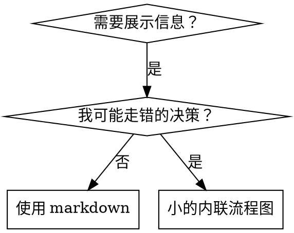

# Writing Skills / 编写 Skills

## 概览

**编写 skills 就是把 TDD 应用于流程文档。**

**个人 skill 存放在你的运行时 skills 目录中**——关于你所用运行时上的路径，参见 [claude-code-tools.md](../using-superpowers/references/claude-code-tools.md)、[codex-tools.md](../using-superpowers/references/codex-tools.md)、[copilot-tools.md](../using-superpowers/references/copilot-tools.md) 或 [gemini-tools.md](../using-superpowers/references/gemini-tools.md)。Codex、Copilot CLI 和 Gemini CLI 还都把 `~/.agents/skills/` 视为跨运行时的别名。

你编写测试用例（带 subagent 的压力场景），看它们失败（基线行为），编写 skill（文档），看测试通过（agent 合规），然后重构（关闭漏洞）。

**核心原则：** 如果你没有看到一个 agent 在没有这个 skill 时失败，你就不知道这个 skill 是否教对了东西。

**必需的前置知识：** 在使用本 skill 之前，你必须理解 superpowers:test-driven-development。那个 skill 定义了基本的 RED-GREEN-REFACTOR 循环。本 skill 将 TDD 适配到文档。

**官方指南：** 关于 Anthropic 官方的 skill 编写最佳实践，参见 anthropic-best-practices.md。该文档提供了补充本 skill 中以 TDD 为核心的方法的额外模式和指南。

## 什么是 Skill？

一个 **skill** 是经过验证的技术、模式或工具的参考指南。Skills 帮助未来的 agent 找到并应用有效的方法。

**Skills 是：** 可复用的技术、模式、工具、参考指南

**Skills 不是：** 关于你某次如何解决问题的叙述

## Skill 的 TDD 映射

| TDD 概念 | Skill 创建 |
|-------------|----------------|
| **测试用例** | 带 subagent 的压力场景 |
| **生产代码** | Skill 文档（SKILL.md） |
| **测试失败（RED）** | Agent 在没有 skill 时违反规则（基线） |
| **测试通过（GREEN）** | Agent 在 skill 存在时合规 |
| **重构** | 在保持合规的同时关闭漏洞 |
| **先写测试** | 在编写 skill 之前运行基线场景 |
| **看它失败** | 文档化 agent 使用的确切合理化借口 |
| **最少代码** | 编写针对那些特定违规的 skill |
| **看它通过** | 验证 agent 现在合规 |
| **重构循环** | 找到新的合理化借口 → 堵住 → 重新验证 |

整个 skill 创建过程遵循 RED-GREEN-REFACTOR。

## 何时创建 Skill

**在这些情况下创建：**
- 一项技术对你来说不是显而易见的
- 你会跨项目再次引用它
- 模式适用广泛（不是项目特定的）
- 其他人会受益

**不要为这些创建：**
- 一次性解决方案
- 在其他地方有充分文档的标准实践
- 项目特定的约定（放进你的指令文件）
- 机械性约束（如果可以用正则/校验强制执行，就自动化它——把文档留给需要判断的事情）

## Skill 类型

### 技术（Technique）
有步骤可遵循的具体方法（condition-based-waiting、root-cause-tracing）

### 模式（Pattern）
思考问题的方式（flatten-with-flags、test-invariants）

### 参考（Reference）
API 文档、语法指南、工具文档（office 文档）

## 目录结构


```
skills/
  skill-name/
    SKILL.md              # 主参考（必需）
    supporting-file.*     # 仅在需要时
```

**扁平命名空间** - 所有 skill 处于一个可搜索的命名空间中

**为以下情况使用单独文件：**
1. **重型参考**（100 行以上）- API 文档、全面的语法
2. **可复用工具** - 脚本、实用程序、模板

**保持内联：**
- 原则和概念
- 代码模式（< 50 行）
- 其他一切

## SKILL.md 结构

**Frontmatter（YAML）：**
- 两个必填字段：`name` 和 `description`（所有支持的字段见 [agentskills.io/specification](https://agentskills.io/specification)）
- 总计最多 1024 个字符
- `name`：仅使用字母、数字和连字符（不要括号、特殊字符）
- `description`：第三人称，仅描述何时使用（不是它做什么）
  - 以 "Use when..." 开头以聚焦触发条件
  - 包含具体的症状、情境和上下文
  - **绝不概括 skill 的流程或工作流**（原因见 SDO 小节）
  - 尽可能保持在 500 字符以内

```markdown
---
name: Skill-Name-With-Hyphens
description: Use when [specific triggering conditions and symptoms]
---

# Skill Name

## Overview
这是什么？1-2 句话的核心原则。

## When to Use
[如果决策不明显，放一个小的内联流程图]

带症状和用例的列表
何时不使用

## Core Pattern（用于技术/模式）
修改前/后代码对比

## Quick Reference
用于快速浏览常见操作的表格或列表

## Implementation
简单模式的内联代码
重型参考或可复用工具链接到文件

## Common Mistakes
出了什么问题 + 修复

## Real-World Impact（可选）
具体结果
```


## Skill 发现优化（Skill Discovery Optimization, SDO）

**对发现至关重要：** 未来的 agent 需要能找到你的 skill

### 1. 丰富的 description 字段

**目的：** 你的 agent 阅读 description 来决定为给定任务加载哪些 skill。让它能回答："我现在应该读这个 skill 吗？"

**格式：** 以 "Use when..." 开头以聚焦触发条件

**关键：description = 何时使用，而不是 skill 做什么**

description 应当只描述触发条件。不要在 description 中概括 skill 的流程或工作流。

**为什么这很重要：** 测试揭示，当 description 概括了 skill 的工作流时，agent 可能会跟随 description 而不是阅读完整的 skill 内容。一个写着"任务之间的 code review"的 description 导致一个 agent 只做了一次 review，尽管 skill 的流程图清楚地显示了两次 review（先规范合规，再代码质量）。

当 description 改为仅"Use when executing implementation plans with independent tasks"（没有工作流概括）时，agent 正确地阅读了流程图并遵循了两阶段 review 流程。

**陷阱：** 概括工作流的 description 创造了一条 agent 会走的捷径。skill 的正文变成了 agent 跳过的文档。

```yaml
# ❌ 坏：概括了工作流——agent 可能跟随它而不是阅读 skill
description: Use when executing plans - dispatches subagent per task with code review between tasks

# ❌ 坏：流程细节太多
description: Use for TDD - write test first, watch it fail, write minimal code, refactor

# ✅ 好：只有触发条件，没有工作流概括
description: Use when executing implementation plans with independent tasks in the current session

# ✅ 好：只有触发条件
description: Use when implementing any feature or bugfix, before writing implementation code
```

**内容：**
- 使用指示此 skill 适用之处的具体触发器、症状和情境
- 描述*问题*（竞态条件、不一致的行为），而不是*特定语言的*症状（setTimeout、sleep）
- 保持触发器与具体技术无关，除非 skill 本身是技术特定的
- 如果 skill 是技术特定的，在触发器中明确说明
- 用第三人称撰写（会被注入到系统提示中）
- **绝不概括 skill 的流程或工作流**

```yaml
# ❌ 坏：太抽象、含糊，不包含何时使用
description: For async testing

# ❌ 坏：第一人称
description: I can help you with async tests when they're flaky

# ❌ 坏：提到了技术但 skill 并不特定于它
description: Use when tests use setTimeout/sleep and are flaky

# ✅ 好：以 "Use when" 开头，描述问题，无工作流
description: Use when tests have race conditions, timing dependencies, or pass/fail inconsistently

# ✅ 好：技术特定的 skill 带明确触发器
description: Use when using React Router and handling authentication redirects
```

### 2. 关键词覆盖

使用 agent 会搜索的词：
- 错误信息："Hook timed out"、"ENOTEMPTY"、"race condition"
- 症状："flaky"、"hanging"、"zombie"、"pollution"
- 同义词："timeout/hang/freeze"、"cleanup/teardown/afterEach"
- 工具：实际的命令、库名、文件类型

### 3. 描述性命名

**使用主动语态，动词在前：**
- ✅ `creating-skills` 而不是 `skill-creation`
- ✅ `condition-based-waiting` 而不是 `async-test-helpers`

### 4. Token 效率（关键）

**问题：** getting-started 和频繁被引用的 skill 会加载进每一次对话。每个 token 都很重要。

**目标字数：**
- getting-started 工作流：每个 < 150 词
- 频繁加载的 skill：总计 < 200 词
- 其他 skill：< 500 词（仍然要简洁）

**技术：**

**把细节移到工具的 help 中：**
```bash
# ❌ 坏：在 SKILL.md 中文档化所有标志
search-conversations supports --text, --both, --after DATE, --before DATE, --limit N

# ✅ 好：引用 --help
search-conversations supports multiple modes and filters. Run --help for details.
```

**使用交叉引用：**
```markdown
# ❌ 坏：重复工作流细节
When searching, dispatch subagent with template...
[20 lines of repeated instructions]

# ✅ 好：引用其他 skill
Always use subagents (50-100x context savings). REQUIRED: Use [other-skill-name] for workflow.
```

**压缩示例：**
```markdown
# ❌ 坏：冗长示例（42 词）
your human partner: "How did we handle authentication errors in React Router before?"
You: I'll search past conversations for React Router authentication patterns.
[Dispatch subagent with search query: "React Router authentication error handling 401"]

# ✅ 好：最简示例（20 词）
Partner: "How did we handle auth errors in React Router?"
You: Searching...
[Dispatch subagent → synthesis]
```

**消除冗余：**
- 不要重复交叉引用 skill 中的内容
- 不要解释从命令就能明显看出的东西
- 不要为同一模式包含多个示例

**验证：**
```bash
wc -w skills/path/SKILL.md
# getting-started 工作流：目标每个 < 150
# 其他频繁加载的：目标总计 < 200
```

**按你做什么或核心洞察命名：**
- ✅ `condition-based-waiting` > `async-test-helpers`
- ✅ `using-skills` 而不是 `skill-usage`
- ✅ `flatten-with-flags` > `data-structure-refactoring`
- ✅ `root-cause-tracing` > `debugging-techniques`

**动名词（-ing）适合流程：**
- `creating-skills`、`testing-skills`、`debugging-with-logs`
- 主动的，描述你正在采取的行动

### 5. 交叉引用其他 Skills

**当编写引用其他 skill 的文档时：**

只使用 skill 名称，带明确的要求标记：
- ✅ 好：`**REQUIRED SUB-SKILL:** Use superpowers:test-driven-development`
- ✅ 好：`**REQUIRED BACKGROUND:** You MUST understand superpowers:systematic-debugging`
- ❌ 坏：`See skills/testing/test-driven-development`（不清楚是否必需）
- ❌ 坏：`@skills/testing/test-driven-development/SKILL.md`（强制加载，消耗上下文）

**为什么不用 @ 链接：** `@` 语法会立即强制加载文件，在你需要它们之前就消耗了 20 万以上的上下文。

## 流程图使用



**仅在以下情况使用流程图：**
- 不明显的决策点
- 你可能过早停止的流程循环
- "何时用 A 而非 B"的决策

**绝不在以下情况使用流程图：**
- 参考材料 → 表格、列表
- 代码示例 → Markdown 代码块
- 线性指令 → 编号列表
- 没有语义含义的标签（step1、helper2）

关于 graphviz 风格规则，参见本目录下的 `graphviz-conventions.dot`。

**为你的 human partner 可视化：** 使用本目录下的 `render-graphs.js` 把一个 skill 的流程图渲染成 SVG：
```bash
./render-graphs.js ../some-skill           # 每个图分别渲染
./render-graphs.js ../some-skill --combine # 所有图合并为一个 SVG
```

## 代码示例

**一个优秀的示例胜过许多平庸的**

选择最相关的语言：
- 测试技术 → TypeScript/JavaScript
- 系统调试 → Shell/Python
- 数据处理 → Python

**好的示例：**
- 完整且可运行
- 注释充分，解释为什么
- 来自真实场景
- 清晰展示模式
- 可直接改编（不是通用模板）

**不要：**
- 用 5 种以上语言实现
- 创建填空式模板
- 编造牵强的示例

你擅长移植——一个绝佳示例就够了。

## 文件组织

### 自包含的 Skill
```
defense-in-depth/
  SKILL.md    # 一切内联
```
何时：所有内容都放得下，不需要重型参考

### 带可复用工具的 Skill
```
condition-based-waiting/
  SKILL.md    # 概览 + 模式
  example.ts  # 可改编的可工作辅助代码
```
何时：工具是可复用代码，而不仅仅是叙述

### 带重型参考的 Skill
```
pptx/
  SKILL.md       # 概览 + 工作流
  pptxgenjs.md   # 600 行 API 参考
  ooxml.md       # 500 行 XML 结构
  scripts/       # 可执行工具
```
何时：参考材料太大无法内联

## 铁律（与 TDD 相同）

```
没有先写出失败的测试，就不写 skill
```

这适用于新 skill 以及对现有 skill 的编辑。

先写 skill 再测试？删掉它。从头来。
不测试就编辑 skill？同样的违规。

**没有例外：**
- 不是为了"简单的添加"
- 不是为了"只是加一节"
- 不是为了"文档更新"
- 不要把未测试的改动留作"参考"
- 不要在跑测试时"改编"它
- 删除就是删除

**必需的前置知识：** superpowers:test-driven-development skill 解释了为什么这很重要。同样的原则适用于文档。

## 测试所有 Skill 类型

不同 skill 类型需要不同的测试方法：

### 强制纪律型 Skills（规则/要求）

**示例：** TDD、verification-before-completion、designing-before-coding

**测试方式：**
- 学术性问题：它们理解规则吗？
- 压力场景：它们在压力下合规吗？
- 多重压力组合：时间 + 沉没成本 + 疲惫
- 识别合理化借口并添加明确的计数器

**成功标准：** agent 在最大压力下遵循规则

### 技术型 Skills（操作指南）

**示例：** condition-based-waiting、root-cause-tracing、defensive-programming

**测试方式：**
- 应用场景：它们能正确应用该技术吗？
- 变体场景：它们处理边界情况吗？
- 缺失信息测试：指令有空白吗？

**成功标准：** agent 成功地把技术应用到新场景

### 模式型 Skills（心智模型）

**示例：** reducing-complexity、information-hiding concepts

**测试方式：**
- 识别场景：它们能识别模式何时适用吗？
- 应用场景：它们能使用该心智模型吗？
- 反例：它们知道何时不适用吗？

**成功标准：** agent 正确地识别何时/如何应用模式

### 参考型 Skills（文档/API）

**示例：** API 文档、命令参考、库指南

**测试方式：**
- 检索场景：它们能找到正确信息吗？
- 应用场景：它们能正确使用找到的信息吗？
- 空白测试：常见用例都覆盖了吗？

**成功标准：** agent 找到并正确应用参考信息

## 跳过测试的常见合理化借口

| 借口 | 现实 |
|--------|---------|
| "skill 显然很清楚" | 对你清楚 ≠ 对其他 agent 清楚。测试它。 |
| "它只是个参考" | 参考也会有空白、不清晰的段落。测试检索。 |
| "测试是杀鸡用牛刀" | 未测试的 skill 有问题。总是如此。15 分钟测试省下数小时。 |
| "出现问题我再测" | 问题 = agent 用不了 skill。在部署前测试。 |
| "测试太繁琐" | 测试比在生产环境调试糟糕的 skill 更不繁琐。 |
| "我确信它是好的" | 过度自信必然带来问题。无论如何都要测。 |
| "学术审查就够了" | 阅读 ≠ 使用。测试应用场景。 |
| "没时间测" | 部署未测试的 skill 会在之后花更多时间修复它。 |

**以上全部意味着：在部署前测试。没有例外。**

## 让形式匹配失败

在编写指南之前，先对基线失败进行分类。能让一种失败类型刀枪不入的形式，在另一种失败上会明显适得其反。

| 基线失败 | 正确形式 | 错误形式 |
|---|---|---|
| 在压力下跳过/违反规则（明知故犯） | 禁令 + 合理化借口表 + 危险信号（见下面的加固） | 软指南（"prefer..."、"consider..."） |
| 合规了，但输出形状错误（臃肿的 prompt、被埋没的裁决、复述的规范） | 正面配方或契约：陈述输出*是*什么——它的各部分，按顺序 | 禁令列表（"不要复述"、"绝不叙述"） |
| 从它们已经产出的东西中遗漏了必需元素 | 结构性的：模板中一个 REQUIRED 字段或填写的槽位 | 靠近模板的散文提醒 |
| 行为应当取决于某个条件 | 以可观察谓词为键的条件（"如果简报存在，引用它"） | 无条件规则 + 豁免条款 |

**为什么禁令在塑造问题上适得其反：** 在相互竞争的激励下（"让 prompt 自包含"），agent 会和"不要 X"谈判。在 dispatch-prompt 指南的正面措辞对照测试中，禁令组产生的不想要内容明显多于配方组（分布完全分离），甚至比无指南对照组更糟——对你自己的案例做微测试，而不是假设，但绝不要默认就伸手拿禁令。配方没有留下任何谈判余地：输出要么匹配陈述的形状，要么不匹配。

**无论你选哪种形式的规则：**
- **不要有细微差别条款。**"除非重要否则不要 X"重新打开了谈判——在一个获胜的配方上附加一个细微差别条款，在同样的措辞测试中把它从一致降级为嘈杂。把真正的例外表达为它自己的、基于可观察谓词的条件。
- **豁免条款不会限定范围。**"此限制不适用于代码块"仍然会抑制代码块。如果输出的一部分必须豁免，重构使规则无法触及它。

## 加固 Skill 以抵抗合理化

强制纪律的 skill（如 TDD）需要抵抗合理化。Agent 很聪明，在压力下会寻找漏洞。

**范围：** 此工具箱用于纪律失败——一个知道规则却在压力下跳过它的 agent。对于错误形状的输出或遗漏的元素，基于禁令的加固会适得其反；改用"让形式匹配失败"中的形式。

**心理学说明：** 理解说服技术为什么有效，有助于你系统地应用它们。关于权威、承诺、稀缺、社会认同和共同体原则的研究基础（Cialdini, 2021; Meincke et al., 2025），见 persuasion-principles.md。

### 显式关闭每一个漏洞

不要只陈述规则——禁止特定的变通方法：

<Bad>
```markdown
先写代码再写测试？删除它。
```
</Bad>

<Good>
```markdown
先写代码再写测试？删除它。从头来。

**没有例外：**
- 不要把它留作"参考"
- 不要在写测试时"改编"它
- 不要看它
- 删除就是删除
```
</Good>

### 应对"精神 vs 字面"的论调

尽早添加基础原则：

```markdown
**违反规则的字面意义，就是违反规则的精神。**
```

这切断了一整类"我遵循的是精神"的合理化借口。

### 构建合理化借口表

从基线测试中捕获合理化借口（见下面的测试小节）。agent 做出的每一个借口都进表：

```markdown
| Excuse | Reality |
|--------|---------|
| "Too simple to test" | Simple code breaks. Test takes 30 seconds. |
| "I'll test after" | Tests passing immediately prove nothing. |
| "Tests after achieve same goals" | Tests-after = "what does this do?" Tests-first = "what should this do?" |
```

### 创建危险信号列表

让 agent 在合理化时易于自检：

```markdown
## Red Flags - STOP and Start Over

- Code before test
- "I already manually tested it"
- "Tests after achieve the same purpose"
- "It's about spirit not ritual"
- "This is different because..."

**All of these mean: Delete code. Start over with TDD.**
```

> 注：上表中保留英文，因为这些是 skill 内部原文示例文本，用于展示表与列表的写法。

### 为违规症状更新 SDO

向 description 添加：你即将违规时的症状：

```yaml
description: use when implementing any feature or bugfix, before writing implementation code
```

## RED-GREEN-REFACTOR for Skills

遵循 TDD 循环：

### RED：写失败的测试（基线）

在没有 skill 的情况下用 subagent 运行压力场景。文档化确切行为：
- 它们做了什么选择？
- 它们用了什么合理化借口（逐字）？
- 哪些压力触发了违规？

这就是"看测试失败"——你必须在编写 skill 之前看到 agent 自然会做什么。

### GREEN：写最少的 Skill

编写针对那些特定合理化借口的 skill。不要为假设性的情况添加额外内容。

用 skill 运行相同场景。Agent 现在应当合规。

### REFACTOR：关闭漏洞

agent 找到了新的合理化借口？添加明确的计数器。重新测试直到刀枪不入。

### 在完整场景之前微测试措辞

完整的压力场景运行是最终关卡，但每次迭代都很慢且昂贵。先用微测试验证措辞本身：

1. **每次调用一个全新上下文样本**——一次原始 API 调用，或者在你没有 API 访问权限时一次性的 subagent。系统提示 = 指南将身处其中的真实上下文（完整的 skill 或 prompt 模板，而不是孤立的指南）；用户消息 = 一个诱惑失败的任务。
2. **始终包含无指南对照组。** 如果对照组没有表现出失败，那就没什么可修的——停下，不要编写指南。
3. **每个变体 5 次以上重复。** 单个样本会撒谎。
4. **手动阅读每一个被标记的匹配。** 如果你喜欢可以编程打分，但模板回声和引用的反例会伪装成命中；自动化计数会同时高估失败和成功。
5. **方差是一个指标。** 当指南落地时，重复会收敛到同一形状。五次重复五种不同解释意味着措辞没有约束力——在加词之前先收紧形式。

微测试验证措辞；对于纪律型 skill，它们不替代压力场景。

**测试方法论：** 完整的测试方法论见 [testing-skills-with-subagents.md](testing-skills-with-subagents.md)：
- 如何编写压力场景
- 压力类型（时间、沉没成本、权威、疲惫）
- 系统地堵漏洞
- 元测试技术

## 反模式

### ❌ 叙事性示例
"在 2025-10-03 的会话中，我们发现空的 projectDir 导致……"
**为什么坏：** 太具体，不可复用

### ❌ 多语言稀释
example-js.js、example-py.py、example-go.go
**为什么坏：** 质量平庸，维护负担重

### ❌ 流程图中的代码
```dot
step1 [label="import fs"];
step2 [label="read file"];
```
**为什么坏：** 无法复制粘贴，难阅读

### ❌ 通用标签
helper1、helper2、step3、pattern4
**为什么坏：** 标签应当有语义含义

## 停下：在进入下一个 Skill 之前

**在编写任何 skill 之后，你必须停下并完成部署流程。**

**不要：**
- 不测试每一个就批量创建多个 skill
- 在当前 skill 验证之前进入下一个
- 因为"批处理更高效"而跳过测试

**下面的部署清单对每个 skill 都是强制性的。**

部署未测试的 skill = 部署未测试的代码。这是对质量标准的违反。

## Skill 创建清单（TDD 适配版）

**重要：为下面每一项清单创建一个 todo。**

**RED 阶段 - 写失败的测试：**
- [ ] 创建压力场景（纪律型 skill 需 3 个以上组合压力）
- [ ] 在没有 skill 的情况下运行场景——逐字文档化基线行为
- [ ] 识别合理化借口/失败中的模式

**GREEN 阶段 - 写最少的 Skill：**
- [ ] 名称仅使用字母、数字、连字符（不要括号/特殊字符）
- [ ] YAML frontmatter 含必填的 `name` 和 `description` 字段（最多 1024 字符；见 [spec](https://agentskills.io/specification)）
- [ ] description 以 "Use when..." 开头并包含具体触发器/症状
- [ ] description 用第三人称撰写
- [ ] 全文含用于搜索的关键词（错误、症状、工具）
- [ ] 清晰的概览，含核心原则
- [ ] 针对在 RED 中识别的具体基线失败
- [ ] 指南形式匹配失败类型（见"让形式匹配失败"）
- [ ] 对于塑造行为的指南：措辞已对照无指南对照组微测试（5 次以上重复，每个被标记匹配手动阅读）——纯参考型 skill 不适用
- [ ] 代码内联或链接到单独文件
- [ ] 一个优秀示例（不要多语言）
- [ ] 用 skill 运行场景——验证 agent 现在合规

**REFACTOR 阶段 - 关闭漏洞：**
- [ ] 识别测试中的新合理化借口
- [ ] 添加明确的计数器（如果是纪律型 skill）
- [ ] 从所有测试迭代构建合理化借口表
- [ ] 创建危险信号列表
- [ ] 重新测试直到刀枪不入

**质量检查：**
- [ ] 仅当决策不明显时才用小流程图
- [ ] 快速参考表
- [ ] 常见错误小节
- [ ] 没有叙事性讲故事
- [ ] 支持文件仅用于工具或重型参考

**部署：**
- [ ] 把 skill 提交到 git 并推送到你的 fork（如已配置）
- [ ] 考虑通过 PR 回馈（如果广泛有用）

## 发现工作流

未来的 agent 如何找到你的 skill：

1. **遇到问题**（"测试 flaky"）
2. **搜索 skills**（grep description、浏览分类）
3. **找到 SKILL**（description 匹配）
4. **扫视概览**（这相关吗？）
5. **阅读模式**（快速参考表）
6. **加载示例**（仅在实现时）

**为此流程优化**——把可搜索的词放得早、放得多。

## 总结

**创建 skills 就是把 TDD 用于流程文档。**

同样的铁律：没有先写失败的测试，就不写 skill。
同样的循环：RED（基线）→ GREEN（编写 skill）→ REFACTOR（关闭漏洞）。
同样的好处：更好的质量、更少的意外、刀枪不入的结果。

如果你为代码遵循 TDD，那就为 skills 也遵循它。这是同样的纪律应用于文档。
