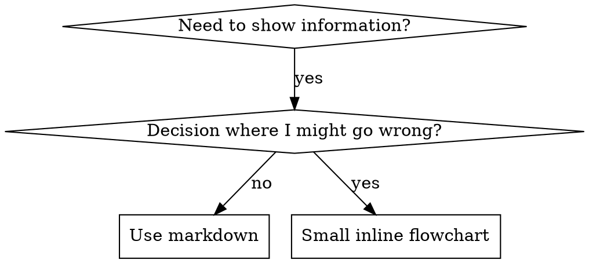

# Writing Skills

## 概述 (Overview)

**编写 skills 就是应用于流程文档的测试驱动开发 (Test-Driven Development)。**

**个人 skills 存在于特定于 agent 的目录中 (`~/.claude/skills` for Claude Code, `~/.agents/skills/` for Codex)**

你编写测试用例 (带有 subagents 的压力场景)，看着它们失败 (基线行为)，编写 skill (文档)，看着测试通过 (agents 遵守)，并重构 (堵塞漏洞)。

**核心原则:** 如果在没有 skill 的情况下你没有看着 agent 失败，你就不知道 skill 是否教授了正确的东西。

**必需背景:** 在使用此 skill 之前，你必须理解 superpowers:test-driven-development。该 skill 定义了基本的 RED-GREEN-REFACTOR 循环。此 skill 将 TDD 改编为文档。

**官方指导:** 有关 Anthropic 的官方 skill 编写最佳实践，请参阅 anthropic-best-practices.md。该文件提供了额外的模式和指南，补充了本 skill 中以 TDD 为中心的方法。

## 什么是 Skill?

**Skill** 是证明有效的技术、模式或工具的参考指南。Skills 帮助未来的 Claude 实例找到并应用有效的方法。

**Skills 是:** 可重用的技术、模式、工具、参考指南

**Skills 不是:** 关于你曾经如何解决问题的叙述

## Skills 的 TDD 映射

| TDD 概念 | Skill 创建 |
|-------------|----------------|
| **Test case** | 带有 subagent 的压力场景 |
| **Production code** | Skill 文档 (SKILL.md) |
| **Test fails (RED)** | Agent 在没有 skill 的情况下违反规则 (基线) |
| **Test passes (GREEN)** | Agent 在 skill 存在的情况下遵守 |
| **Refactor** | 在保持合规的同时堵塞漏洞 |
| **Write test first** | 在编写 skill 之前运行基线场景 |
| **Watch it fail** | 记录 agent 使用的确切合理化 (rationalizations) |
| **Minimal code** | 编写 skill 解决那些特定的违规行为 |
| **Watch it pass** | 验证 agent 现在遵守 |
| **Refactor cycle** | 找到新的合理化 → 堵塞 → 重新验证 |

整个 skill 创建过程遵循 RED-GREEN-REFACTOR。

## 何时创建 Skill

**创建当:**
- 技术对你来说不是直观明显的
- 你会在跨项目中再次引用它
- 模式广泛适用 (不是特定于项目的)
- 其他人会受益

**不要创建:**
- 一次性解决方案
- 在其他地方有详细记录的标准实践
- 项目特定的惯例 (放入 CLAUDE.md)
- 机械约束 (如果可以用 regex/验证强制执行，自动化它——保留文档用于判断调用)

## Skill 类型

### 技术 (Technique)
遵循的具体方法步骤 (condition-based-waiting, root-cause-tracing)

### 模式 (Pattern)
思考问题的方式 (flatten-with-flags, test-invariants)

### 参考 (Reference)
API 文档，语法指南，工具文档 (office docs)

## 目录结构

```
skills/
  skill-name/
    SKILL.md              # Main reference (required)
    supporting-file.*     # Only if needed
```

**扁平命名空间** - 所有 skills 在一个可搜索的命名空间中

**单独文件用于:**
1.  **重参考** (100+ lines) - API 文档，综合语法
2.  **可重用工具** - 脚本，实用程序，模板

**保持内联:**
- 原则和概念
- 代码模式 (< 50 lines)
- 其他一切

## SKILL.md 结构

**Frontmatter (YAML):**
- 两个必需字段: `name` 和 `description`
- 总共最多 1024 个字符
- `name`: 仅使用字母、数字和连字符 (无括号，特殊字符)
- `description`: 第三人称，仅描述何时使用 (不是它做什么)
    - 以 "Use when..." 开头以关注触发条件
    - 包含具体症状、情况和上下文
    - **绝不总结 skill 的流程或工作流** (见 CSO 部分原因)
    - 如果可能，保持在 500 个字符以下

```markdown
---
name: Skill-Name-With-Hyphens
description: Use when [specific triggering conditions and symptoms]
---

# Skill Name

## Overview
What is this? Core principle in 1-2 sentences.

## When to Use
[Small inline flowchart IF decision non-obvious]

Bullet list with SYMPTOMS and use cases
When NOT to use

## Core Pattern (for techniques/patterns)
Before/after code comparison

## Quick Reference
Table or bullets for scanning common operations

## Implementation
Inline code for simple patterns
Link to file for heavy reference or reusable tools

## Common Mistakes
What goes wrong + fixes

## Real-World Impact (optional)
Concrete results
```

## Claude Search Optimization (CSO)

**对于发现至关重要:** 未来的 Claude 需要**找到**你的 skill

### 1. 丰富的 Description 字段

**目的:** Claude 阅读 description 以决定通过给定任务加载哪些 skills。使其回答: "Should I read this skill right now?"

**格式:** 以 "Use when..." 开头以关注触发条件

**关键: Description = 何时使用，不是 Skill 做什么**

Description 应仅描述触发条件。不要在 description 中总结 skill 的流程或工作流。

**为什么这很重要:** 测试表明，当 description 总结 skill 的工作流时，Claude 可能会遵循 description 而不是阅读完整的 skill 内容。Description 说 "code review between tasks" 导致 Claude 做了一次审查，即使 skill 的流程图清楚地显示了两次审查 (spec compliance then code quality)。

当 description 更改为仅 "Use when executing implementation plans with independent tasks" (无工作流总结) 时，Claude 正确读取流程图并遵循两阶段审查过程。

**陷阱:** 总结工作流的 Descriptions 创建了 Claude 会走的捷径。Skill 正文变成 Claude 跳过的文档。

```yaml
# ❌ BAD: Summarizes workflow - Claude may follow this instead of reading skill
description: Use when executing plans - dispatches subagent per task with code review between tasks

# ❌ BAD: Too much process detail
description: Use for TDD - write test first, watch it fail, write minimal code, refactor

# ✅ GOOD: Just triggering conditions, no workflow summary
description: Use when executing implementation plans with independent tasks in the current session

# ✅ GOOD: Triggering conditions only
description: Use when implementing any feature or bugfix, before writing implementation code
```

**内容:**
- 使用具体的触发器、症状和情况来表明此 skill 适用
- 描述 *问题* (race conditions, inconsistent behavior) 而不是 *特定于语言的症状* (setTimeout, sleep)
- 保持触发器与技术无关，除非 skill 本身是特定于技术的
- 如果 skill 是特定于技术的，在触发器中明确说明
- 用第三人称写 (注入到 system prompt)
- **绝不总结 skill 的流程或工作流**

```yaml
# ❌ BAD: Too abstract, vague, doesn't include when to use
description: For async testing

# ❌ BAD: First person
description: I can help you with async tests when they're flaky

# ❌ BAD: Mentions technology but skill isn't specific to it
description: Use when tests use setTimeout/sleep and are flaky

# ✅ GOOD: Starts with "Use when", describes problem, no workflow
description: Use when tests have race conditions, timing dependencies, or pass/fail inconsistently

# ✅ GOOD: Technology-specific skill with explicit trigger
description: Use when using React Router and handling authentication redirects
```

### 2. 关键词覆盖

使用 Claude 会搜索的词:
- 错误信息: "Hook timed out", "ENOTEMPTY", "race condition"
- 症状: "flaky", "hanging", "zombie", "pollution"
- 同义词: "timeout/hang/freeze", "cleanup/teardown/afterEach"
- 工具: 实际命令, 库名称, 文件类型

### 3. 描述性命名

**使用主动语态，动词优先:**
- ✅ `creating-skills` not `skill-creation`
- ✅ `condition-based-waiting` not `async-test-helpers`

### 4. Token 效率 (关键)

**问题:** getting-started 和经常引用的 skills 加载到每个对话中。每个 token 都有价值。

**目标字数:**
- getting-started workflows: 每个 <150 words
- Keep frequently-loaded skills: 总共 <200 words
- Other skills: <500 words (仍然要简洁)

**技术:**

**将详细信息移至工具帮助:**
```bash
# ❌ BAD: Document all flags in SKILL.md
search-conversations supports --text, --both, --after DATE, --before DATE, --limit N

# ✅ GOOD: Reference --help
search-conversations supports multiple modes and filters. Run --help for details.
```

**使用交叉引用:**
```markdown
# ❌ BAD: Repeat workflow details
When searching, dispatch subagent with template...
[20 lines of repeated instructions]

# ✅ GOOD: Reference other skill
Always use subagents (50-100x context savings). REQUIRED: Use [other-skill-name] for workflow.
```

**压缩示例:**
```markdown
# ❌ BAD: Verbose example (42 words)
your human partner: "How did we handle authentication errors in React Router before?"
You: I'll search past conversations for React Router authentication patterns.
[Dispatch subagent with search query: "React Router authentication error handling 401"]

# ✅ GOOD: Minimal example (20 words)
Partner: "How did we handle auth errors in React Router?"
You: Searching...
[Dispatch subagent → synthesis]
```

**消除冗余:**
- 不要重复交叉引用的 skills 中的内容
- 不要解释命令中显而易见的内容
- 不要包含相同模式的多个示例

**验证:**
```bash
wc -w skills/path/SKILL.md
# getting-started workflows: aim for <150 each
# Other frequently-loaded: aim for <200 total
```

**以你做什么或核心见解命名:**
- ✅ `condition-based-waiting` > `async-test-helpers`
- ✅ `using-skills` not `skill-usage`
- ✅ `flatten-with-flags` > `data-structure-refactoring`
- ✅ `root-cause-tracing` > `debugging-techniques`

**动名词 (-ing) 适用于流程:**
- `creating-skills`, `testing-skills`, `debugging-with-logs`
- 主动，描述你正在采取的行动

### 4. 交叉引用其他 Skills

**当编写引用其他 skills 的文档时:**

仅使用 skill 名称，带有明确的要求标记:
- ✅ Good: `**REQUIRED SUB-SKILL:** Use superpowers:test-driven-development`
- ✅ Good: `**REQUIRED BACKGROUND:** You MUST understand superpowers:systematic-debugging`
- ❌ Bad: `See skills/testing/test-driven-development` (不清楚是否必须)
- ❌ Bad: `@skills/testing/test-driven-development/SKILL.md` (强制立即加载，消耗 200k+ context)

**为什么没有 @ 链接:** `@` 语法立即强制加载文件，在你需要它们之前消耗 200k+ context。

## 流程图使用



**仅用于以下情况使用流程图:**
- 非明显的决策点
- 你可能过早停止的流程循环
- "When to use A vs B" 决策

**绝不用于以下情况使用流程图:**
- 参考资料 → 表格，列表
- 代码示例 → Markdown 块
- 线性指令 → 编号列表
- 没有语义意义的标签 (step1, helper2)

见 @graphviz-conventions.dot 了解 graphviz 样式规则。

**为你的人类伙伴可视化:** 使用此目录中的 `render-graphs.js` 将 skill 的流程图渲染为 SVG:
```bash
./render-graphs.js ../some-skill           # Each diagram separately
./render-graphs.js ../some-skill --combine # All diagrams in one SVG
```

## 代码示例

**一个优秀的示例胜过许多平庸的示例**

选择最相关的语言:
- Testing techniques → TypeScript/JavaScript
- System debugging → Shell/Python
- Data processing → Python

**好的示例:**
- 完整且可运行
- 注释良好解释**为什么**
- 来自真实场景
- 清晰展示模式
- 准备好适应 (不是通用模板)

**不要:**
- 用 5+ 种语言实施
- 创建填空模板
- 编写做作的示例

你擅长移植 - 一个很棒的示例就足够了。

## 文件组织

### 自包含 Skill
```
defense-in-depth/
  SKILL.md    # Everything inline
```
当: 所有内容都适合，不需要重参考

### 带有可重用工具的 Skill
```
condition-based-waiting/
  SKILL.md    # Overview + patterns
  example.ts  # Working helpers to adapt
```
当: 工具是可重用代码，不仅仅是叙述

### 带有重参考的 Skill
```
pptx/
  SKILL.md       # Overview + workflows
  pptxgenjs.md   # 600 lines API reference
  ooxml.md       # 500 lines XML structure
  scripts/       # Executable tools
```
当: 参考资料太大无法内联

## 铁律 (The Iron Law) (Same as TDD)

```
没有先失败的测试就没有 SKILL (NO SKILL WITHOUT A FAILING TEST FIRST)
```

这适用于**新** skills **和**对现有 skills 的**编辑**。

测试前写 skill？删除它。重新开始。
未测试就编辑 skill？同样的违规。

**无例外:**
- 不是为了 "simple additions"
- 不是为了 "just adding a section"
- 不是为了 "documentation updates"
- 不要保留未测试的更改作为 "reference"
- 不要在运行测试时 "改编"
- 删除意味着删除

**必需背景:** superpowers:test-driven-development skill 解释了为什么这很重要。同样的原则适用于文档。

## 测试所有 Skill 类型

不同的 skill 类型需要不同的测试方法:

### 纪律执行 Skills (requirements/rules)

**示例:** TDD, verification-before-completion, designing-before-coding

**测试方式:**
- 学术问题: 他们理解规则吗？
- 压力场景: 他们在压力下顺从吗？
- 多种压力结合: 时间 + 沉没成本 + 疲劳
- 识别合理化并添加明确反击

**成功标准:** Agent 在最大压力下遵循规则

### 技术 Skills (how-to guides)

**示例:** condition-based-waiting, root-cause-tracing, defensive-programming

**测试方式:**
- 应用场景: 他们能正确应用技术吗？
- 变化场景: 他们处理边界情况吗？
- 缺失信息测试: 指令有缺口吗？

**成功标准:** Agent 成功将技术应用于新场景

### 模式 Skills (mental models)

**示例:** reducing-complexity, information-hiding concepts

**测试方式:**
- 识别场景: 他们识别模式何时适用吗？
- 应用场景: 他们能使用心智模型吗？
- 反例: 他们知道何时**不**适用吗？

**成功标准:** Agent 正确识别何时/如何应用模式

### 参考 Skills (documentation/APIs)

**示例:** API documentation, command references, library guides

**测试方式:**
- 检索场景: 他们能找到正确的信息吗？
- 应用场景: 他们能正确使用找到的信息吗？
- 缺口测试: 常见用例被覆盖了吗？

**成功标准:** Agent 找到并正确应用参考信息

## 跳过测试的常见借口

| 借口 | 现实 |
|--------|---------|
| "Skill 显而易见" | 对你清楚 ≠ 对其他 agents 清楚。测试它。 |
| "这只是一个参考" | 参考可能有缺口，不清楚的部分。测试检索。 |
| "测试是大材小用" | 未测试的 skills 有问题。总是。15 分钟测试节省数小时。 |
| "如果出现问题我会测试" | 问题 = agents 无法使用 skill。在部署**之前**测试。 |
| "测试太乏味" | 测试比在生产中调试糟糕的 skill 不那么乏味。 |
| "我确信它是好的" | 过度自信保证有问题。无论如何都要测试。 |
| "学术审查就够了" | 阅读 ≠ 使用。测试应用场景。 |
| "没时间测试" | 部署未测试的 skill 之后会浪费更多时间来修复它。 |

**所有这些意味着: 部署前测试。无例外。**

## 针对合理化使 Skills 无懈可击

强制纪律的 Skills (如 TDD) 需要抵制合理化。Agents 很聪明，在压力下会找到漏洞。

**心理学笔记:** 理解**为什么**说服技术起作用有助于你系统地应用它们。参见 persuasion-principles.md (Cialdini, 2021; Meincke et al., 2025) 了解权威、承诺、稀缺性、社会证明和一致性原则及其研究基础。

### 明确堵塞每个漏洞

不要只陈述规则 - 禁止特定的变通方法:

<Bad>
```markdown
Write code before test? Delete it.
```
</Bad>

<Good>
```markdown
Write code before test? Delete it. Start over.

**No exceptions:**
- Don't keep it as "reference"
- Don't "adapt" it while writing tests
- Don't look at it
- Delete means delete
```
</Good>

### 解决 "精神 vs 字面" 争论

尽早添加基本原则:

```markdown
**违反规则的字面意思就是违反规则的精神。**
```

这切断了整个类别的 "I'm following the spirit" 合理化。

### 构建合理化表格

从基线测试中捕获合理化 (见下文测试部分)。agents 制造的每个借口都放入表格:

```markdown
| Excuse | Reality |
|--------|---------|
| "Too simple to test" | Simple code breaks. Test takes 30 seconds. |
| "I'll test after" | Tests passing immediately prove nothing. |
| "Tests after achieve same goals" | Tests-after = "what does this do?" Tests-first = "what should this do?" |
```

### 创建危险信号列表

使 agents 在合理化时容易自查:

```markdown
## Red Flags - STOP and Start Over

- Code before test
- "I already manually tested it"
- "Tests after achieve the same purpose"
- "It's about spirit not ritual"
- "This is different because..."

**All of these mean: Delete code. Start over with TDD.**
```

### 更新 CSO 以针对违规症状

添加到 description: 当你**即将**违反规则时的症状:

```yaml
description: use when implementing any feature or bugfix, before writing implementation code
```

## Skills 的 RED-GREEN-REFACTOR

遵循 TDD 循环:

### RED: 编写失败测试 (Baseline)

在**没有** skill 的情况下运行 subagent 的压力场景。记录确切行为:
- 他们做了什么选择？
- 他们使用了什么合理化 (逐字)？
- 哪些压力触发了违规？

这是 "watching the test fail" - 在编写 skill 之前，你必须看到 agents 自然会做什么。

### GREEN: 编写最小 Skill

编写解决那些特定合理化的 skill。不要为假设情况添加额外内容。

**有** skill 的情况下运行相同的场景。Agent 现在应该遵守。

### REFACTOR: 堵塞漏洞

Agent 找到了新的合理化？添加明确反击。重新测试直到无懈可击。

**测试方法:** 见 @testing-skills-with-subagents.md 获取完整的测试方法:
- 如何编写压力场景
- 压力类型 (时间, 沉没成本, 权威, 疲劳)
- 系统地堵塞漏洞
- 元测试技术 (Meta-testing)

## Anti-Patterns

### ❌ 叙述性示例
"In session 2025-10-03, we found empty projectDir caused..."
**Why bad:** 太具体，不可重用

### ❌ 多语言稀释
example-js.js, example-py.py, example-go.go
**Why bad:** 平庸质量，维护负担

### ❌ 流程图中的代码
```dot
step1 [label="import fs"];
step2 [label="read file"];
```
**Why bad:** 无法复制粘贴，难以阅读

### ❌ 通用标签
helper1, helper2, step3, pattern4
**Why bad:** 标签应具有语义意义

## STOP: 在移动到下一个 Skill 之前

**编写任何 skill 后，你必须停止并完成部署过程。**

**不要:**
- 批量创建多个 skills 而不测试每个
- 在当前 skill 验证之前移动到下一个
- 因为 "batching is more efficient" 而跳过测试

**下面的部署清单对于每个 skill 都是强制性的。**

部署未测试的 skills = 部署未测试的代码。这违反了质量标准。

## Skill创建清单 (TDD 改编)

**重要: 使用 TodoWrite 为下面的每个清单项创建 todos。**

**RED Phase - 编写失败测试:**
- [ ] 创建压力场景 (纪律 skills 的 3+ 组合压力)
- [ ] 运行**无** skill 的场景 - 逐字记录基线行为
- [ ] 识别合理化/失败中的模式

**GREEN Phase - 编写最小 Skill:**
- [ ] 名称仅使用字母、数字、连字符 (没有括号/特殊字符)
- [ ] YAML frontmatter 仅包含 name 和 description (最多 1024 字符)
- [ ] Description 以 "Use when..." 开头并包含具体触发器/症状
- [ ] Description 用第三人称写
- [ ] 用于搜索的关键词贯穿始终 (errors, symptoms, tools)
- [ ] 清晰的 overview 和核心原则
- [ ] 解决 RED 中识别的具体基线失败
- [ ] 代码内联或链接到单独文件
- [ ] 一个优秀的示例 (不是多语言)
- [ ] 运行**有** skill 的场景 - 验证 agents 现在遵守

**REFACTOR Phase - 堵塞漏洞:**
- [ ] 识别测试中的**新**合理化
- [ ] 添加明确反击 (如果纪律 skill)
- [ ] 从所有测试迭代中构建合理化表格
- [ ] 创建危险信号列表
- [ ] 重新测试直到无懈可击

**质量检查:**
- [ ] 小流程图仅当决策不明显时
- [ ] 快速参考表
- [ ] 常见错误部分
- [ ] 无叙述性讲故事
- [ ] 仅用于工具或重参考的支持文件

**部署:**
- [ ] Commit skill 到 git 并 push 到你的 fork (如果已配置)
- [ ] 考虑通过 PR 贡献回去 (如果广泛有用)

## 发现工作流

未来的 Claude 如何找到你的 skill:

1.  **遇到问题** ("tests are flaky")
3.  **发现 SKILL** (description 匹配)
4.  **扫描 overview** (这相关吗？)
5.  **阅读模式** (快速参考表)
6.  **加载示例** (仅当实施时)

**为此流程优化** - 尽早并经常放置可搜索术语。

## 总结 (The Bottom Line)

**创建 skills 就是流程文档的 TDD。**

同样的铁律: 没有先失败的测试就没有 skill。
同样的循环: RED (baseline) → GREEN (write skill) → REFACTOR (close loopholes)。
同样的好处: 更好的质量，更少的意外，无懈可击的结果。

如果你对代码遵循 TDD，对 skills 也要遵循。这是应用于文档的相同纪律。
